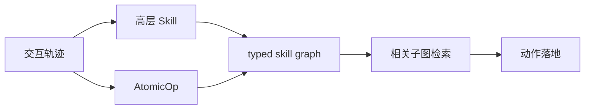
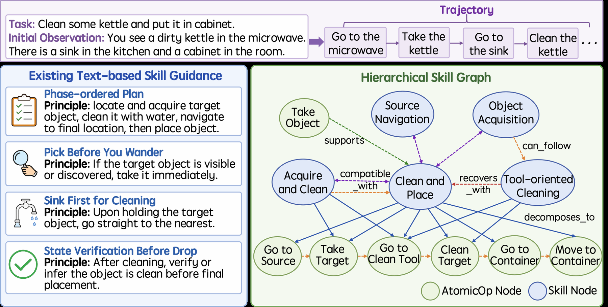

# HiSkill：层次化 Skill Graph

> 保真度：实现论文可隔离的核心状态与更新机制，并在统一公开数据或确定性
> mini-suite 上运行；不把轻量机制实验写成原规模大模型复现。

## 论文信息

| 字段 | 内容 |
|---|---|
| 论文链接 | [HiSkill：层次化 Skill Graph（arXiv 2607.25853）](https://arxiv.org/abs/2607.25853) |
| 公司 / 机构 | Beijing University of Posts and Telecommunications |
| 首次公开日期 | 2026-07-28 |
| 原作者代码 | [已开源](https://github.com/BUPT-GAMMA/HiSkill) |
| 本地 adapter / 算法键 | `hiskill` |
| 本地复现代码 | [`src/auto_research/agent_research/`](https://github.com/daiwk/auto-research/tree/main/src/auto_research/agent_research/) |

## 原始论文总结

### 背景与主要改动

用高层 skill、可执行 AtomicOp 和多类有向边组织经验，推理时只检索任务相关子图来落地动作。



<!-- paper-figure:start -->
### 原论文关键图

[](https://arxiv.org/html/2607.25853v1/Figures/intro.png)

> **原论文 Figure 1（关键图）**：展示原论文方法的总体设计和关键组成。图片来自[原论文](https://arxiv.org/abs/2607.25853)，版权归原作者所有；点击图片可查看来源。
<!-- paper-figure:end -->

### 核心公式

$$
G=(V_{\mathrm{skill}}\cup V_{\mathrm{op}},E_{\mathrm{decomp}}\cup E_{\mathrm{temporal}}\cup E_{\mathrm{recovery}}),\quad a_t=\operatorname{Ground}(s_t,G_t).
$$

### 论文离线与线上效果

在三个交互环境上超过强基线，同时降低推理 token 消耗。 论文没有报告生产线上 A/B，因此本站只保留离线/环境评测口径。

## 本地复现

PlanBench mini-suite 构建高层 skill/AtomicOp 节点及 decomposition、transition、recovery 边，记录子图复用。

| 指标 | HiSkill |
|---|---:|
| joint success | 1.0000 |
| average cost | 0.6900 |
| graph nodes / edges / AtomicOp reuse | 48 / 60 / 324 |

```bash
auto-research agent-eval --method hiskill --episodes 120 --seed 42
```

固定 seed 指标见
[`agent-20260729-seed42.json`](../../experiments/agent-20260729-seed42.json)。

## 复现边界

图节点来自受控轨迹，不由在线 LLM 抽取；主要验证层次和关系是否改善复用。
