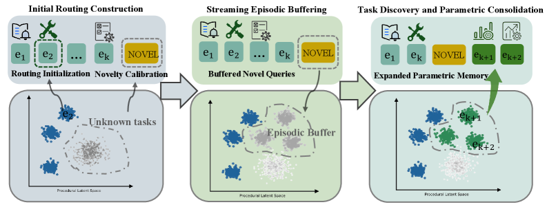

# UniMem：情景记忆到参数记忆的互补路由

> 保真度：实现论文可隔离的核心状态与更新机制，并在统一公开数据或确定性
> mini-suite 上运行；不把轻量机制实验写成原规模大模型复现。

## 论文信息

| 字段 | 内容 |
|---|---|
| 论文链接 | [UniMem：情景记忆到参数记忆的互补路由（arXiv 2607.26017）](https://arxiv.org/abs/2607.26017) |
| 公司 / 机构 | CASIA / UCAS / Peking University / University College London |
| 首次公开日期 | 2026-07-28 |
| 原作者代码 | 截至 2026-07-29 未发现官方公开仓库 |
| 本地 adapter / 算法键 | `unimem` |
| 本地复现代码 | [`src/auto_research/agent_research/`](https://github.com/daiwk/auto-research/tree/main/src/auto_research/agent_research/) |

## 原始论文总结

### 背景与主要改动

新颖任务先进入 episodic buffer；反复出现且可靠的执行模式再被自路由控制器固化到可扩展 parametric memory。


<!-- paper-figure:start -->
### 原论文关键图

[](https://arxiv.org/html/2607.26017v1/x1.png)

> **原论文 Figure 1（关键图）**：展示原论文的整体流程、关键阶段及其数据流向。图片来自[原论文](https://arxiv.org/abs/2607.26017)，版权归原作者所有；点击图片可查看来源。
<!-- paper-figure:end -->

### 核心公式

$$
z_t=\operatorname{Route}_\theta(x_t),\quad M_p\leftarrow M_p\oplus\operatorname{Consolidate}(M_e)\ \text{if recurrence}\ge\tau.
$$

### 论文离线与线上效果

在长程流式任务上保持执行 fidelity，三个 backbone 平均提高 4.0 个 EM 点。 论文没有报告生产线上 A/B，因此本站只保留离线/环境评测口径。

## 本地复现

EvoMem mini-suite 实现 episodic route、复现频次阈值、parametric route 和 consolidation 统计。

| 指标 | UniMem |
|---|---:|
| joint success | 1.0000 |
| average cost | 0.5200 |
| episodic / parametric / consolidation | 24 / 96 / 12 |

```bash
auto-research agent-eval --method unimem --episodes 120 --seed 42
```

固定 seed 指标见
[`agent-20260729-seed42.json`](../../experiments/agent-20260729-seed42.json)。

## 复现边界

参数记忆是结构化模式表，不是扩展 LLM 权重块；验证稳定性/可塑性路由逻辑。
