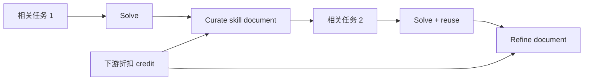
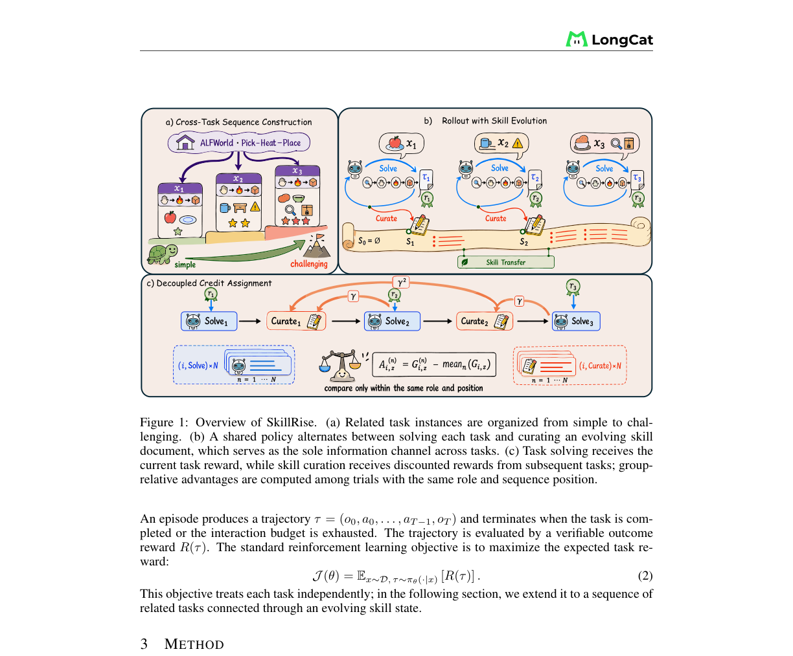

# SkillRise

## 论文信息

| 字段 | 内容 |
|---|---|
| 论文链接 | [arXiv 2607.26784](https://arxiv.org/abs/2607.26784) |
| 公司 / 机构 | Zhejiang University / National University of Singapore / Shanghai Jiao Tong University / Meituan |
| 首次公开日期 | 2026-07-29（arXiv v1） |
| 原作者代码 | [已开源](https://github.com/Within-yao/SkillRise) |
| 本地 adapter / 方法 key | `skillrise` |
| 本地复现代码 | `src/auto_research/agent_research/methods.py` |

## 原始论文总结

### 背景与主要改动

标准 Agent RL 把任务视为独立 episode，外部 skill bank 又把抽取、检索和执行缠在一起。
SkillRise 把相关但不同的任务排成由易到难的序列，让同一 policy 交替求解当前任务与
整理一个直接传给下一任务的 skill document；求解阶段由当前结果监督，整理阶段由折扣
后的下游任务结果监督。



<!-- paper-figure:start -->
### 原论文关键图

[](https://arxiv.org/abs/2607.26784)

图片来自[原论文](https://arxiv.org/abs/2607.26784)，版权归原作者所有；点击图片可查看来源。
<!-- paper-figure:end -->

### 核心公式

对序列中第 $i$ 个任务，solve phase 使用当前任务结果，curation phase 使用下游回报：

$$
A^{\rm solve}_i=R_i-b_i,\qquad
A^{\rm curate}_i=\sum_{j=i+1}^{K}\gamma^{j-i-1}R_j-b_i^{\rm curate},
$$

两个 phase 共享 policy，但只把各自 advantage 施加到对应生成 token。

### 论文离线与线上效果

Qwen3-4B Pass@1：ALFWorld 85.9%、WebShop 84.4%、ScienceWorld 54.6%，分别比
最强基线高 2.3、7.1、8.5 个百分点；Pass@3 为 92.2%、96.1%、61.0%。该论文没有
生产线上 A/B。

## 本地复现

PlanBench mini 按 task axis 组织相关任务；每个 episode 交替执行 solve 和 curate，
成功轨迹更新 skill document，并单独记录跨任务复用与下游 credit。

```bash
auto-research agent-eval --method skillrise --benchmark planbench-mini \
  --episodes 120 --seed 42
```

joint success 1.0000、平均成本 0.655；创建 1 个 skill document、跨任务复用 119 次、
文档更新 120 次、下游 credit update 360 次。完整指标见
[`latest-cross-domain-20260730-seed42.json`](../../experiments/latest-cross-domain-20260730-seed42.json)。

## 复现边界

本地验证状态演化与 credit 分离，不训练 Qwen3，也不运行 ALFWorld/WebShop/ScienceWorld；
因此不能把 mini-suite 的 100% success 与论文 Pass@k 横向比较。
