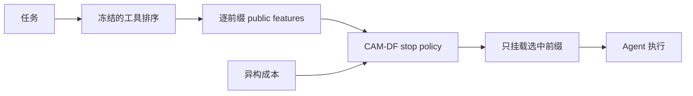
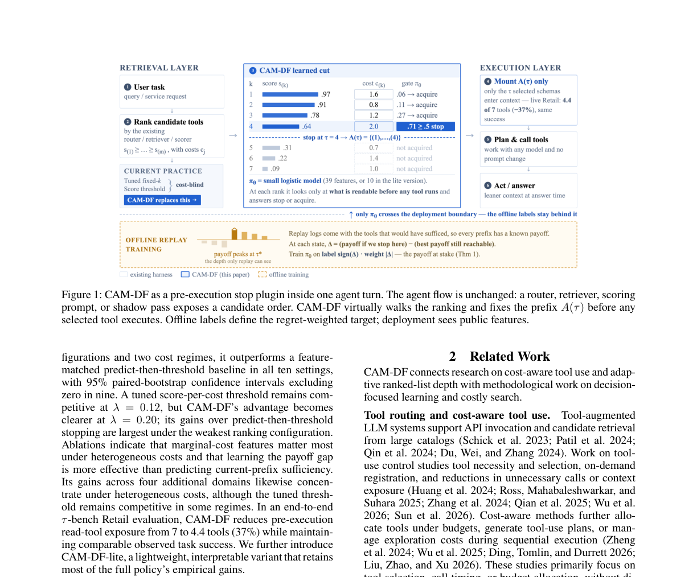

# CAM-DF

## 论文信息

| 字段 | 内容 |
|---|---|
| 论文链接 | [arXiv 2607.27083](https://arxiv.org/abs/2607.27083) |
| 公司 / 机构 | Peking University / McGill University / Shanghai University of Finance and Economics / Tsinghua University |
| 首次公开日期 | 2026-07-29（arXiv v1） |
| 原作者代码 | 论文称提供 cached artifacts / evaluation scripts，但未找到公开仓库链接 |
| 本地 adapter / 方法 key | `cam-df` |
| 本地复现代码 | `src/auto_research/agent_research/methods.py` |

## 原始论文总结

### 背景与主要改动

工具 router 只能给出相关性排序，不能回答“应该开放前几个工具”。CAM-DF 在任何工具
执行前虚拟遍历排序前缀，以任务充分性减异构工具成本作为 payoff；停止当前前缀与最佳
后续前缀的 payoff gap 决定标签，gap 绝对值决定错误的 regret 权重。



<!-- paper-figure:start -->
### 原论文关键图

[](https://arxiv.org/abs/2607.27083)

图片来自[原论文](https://arxiv.org/abs/2607.27083)，版权归原作者所有；点击图片可查看来源。
<!-- paper-figure:end -->

### 核心公式

$$
U(A,x)=\operatorname{sufficiency}(A,x)-\lambda\sum_{j\in A}c_j,
$$

$$
\Delta_t=Q_{\rm stop}(t)-Q_{\rm cont}(t),\quad
y_t=\mathbf 1[\Delta_t\ge0],\quad w_t=|\Delta_t|+\epsilon.
$$

### 论文离线与线上效果

共 1,343 个任务、五个工具域；在 τ-bench Retail 的 live execution 中，平均可读工具
从 7 个降到 4.4 个（-37%），task success 基本相当。该论文没有生产线上 A/B。

## 本地复现

ScaleMCP mini 为每个任务构造冻结排序和异构成本，枚举所有前缀的下游 payoff，执行
regret-weighted 停止并只挂载所选工具。

```bash
auto-research agent-eval --method cam-df --benchmark scalemcp-mini \
  --episodes 120 --seed 42
```

joint success 1.0000；980 个候选工具只开放 480 个，exposure -51.02%，120/120
episode 发生提前停止。完整指标见
[`latest-cross-domain-20260730-seed42.json`](../../experiments/latest-cross-domain-20260730-seed42.json)。

## 复现边界

本地是确定性工具 mini-suite，不是 τ-bench Retail live execution；充分性来自 benchmark
可审计 required-tools，而不是另训的 scorer。
