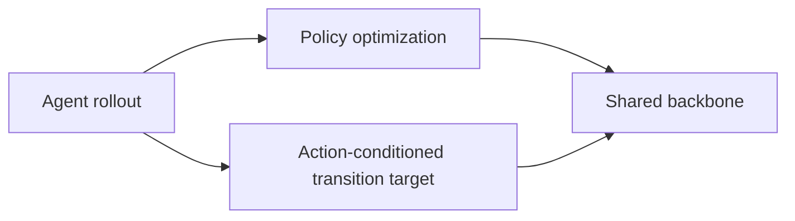
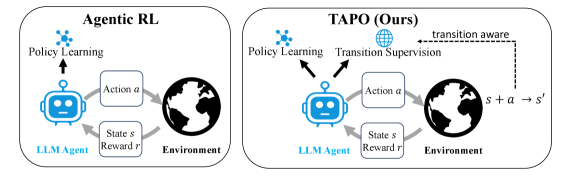

# TAPO：转移感知的 Agent 策略优化

> 保真度：在确定性环境实际交替执行 policy action 与 action-conditioned next-observation supervision。

## 论文信息

| 字段 | 内容 |
|---|---|
| 论文链接 | [TAPO（arXiv 2607.27973）](https://arxiv.org/abs/2607.27973) |
| 公司 / 机构 | Peking University / Pengcheng Laboratory |
| 首次公开日期 | 2026-07-30 |
| 原作者代码 | 未发现/未发布官方实现（核查日期：2026-08-01） |
| 本地 adapter / 方法键 | `tapo` |
| 本地复现代码 | [`src/auto_research/agent_research/`](https://github.com/daiwk/auto-research/tree/main/src/auto_research/agent_research/) |

## 原始论文总结

### 背景与主要改动

稀疏任务 reward 只告诉 Agent 最终成败，没有利用每次动作后的环境反馈。TAPO 复用同一 rollout，在共享 backbone 上交替训练策略目标与 $(s_t,a_t)\to s_{t+1}$ 的 next-observation 预测，不增加采样、专家数据或推理开销。



<!-- paper-figure:start -->
### 原论文关键图

[](https://arxiv.org/html/2607.27973v1/x1.png)

图片来自[原论文](https://arxiv.org/abs/2607.27973)，版权归原作者所有；点击图片可查看来源。
<!-- paper-figure:end -->

### 核心公式

$$
\mathcal L=\mathcal L_{\mathrm{policy}}+\lambda\,\mathbb E[-\log p_\theta(s_{t+1}\mid s_t,a_t)].
$$

### 论文离线与线上效果

在 WebShop、ALFWorld 的 1.5B/7B 模型和多种策略优化器上稳定超过纯 policy optimization，并改善转移预测 perplexity；论文无生产 A/B。

## 本地复现

> **本地对照口径**：PlanBench mini-suite 120 episodes；与只看 outcome 的 Agent 比较，TAPO 保持 joint success 1.0000，并新增 **360 个 transition targets、预测准确率 1.0000**。

```bash
auto-research agent-eval --method tapo --benchmark planbench-mini --episodes 120 --seed 42
```

固定指标见 [`tapo-grsd-planbench-seed42.json`](../../experiments/tapo-grsd-planbench-seed42.json)。

## 复现边界

确定性 observation 适合验证数据流与交替目标，不等同于 Qwen2.5 在 WebShop/ALFWorld 的 RL 训练。
