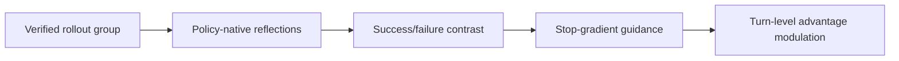
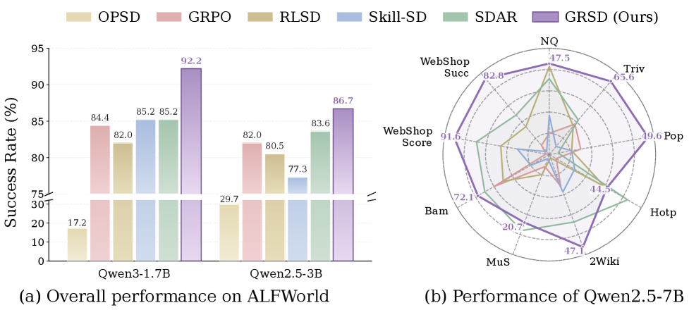

# GRSD：组反思式 Agent 自蒸馏

> 保真度：执行成功/失败 rollout group、策略自身反思、stop-gradient group guidance 与 turn-level 更新。

## 论文信息

| 字段 | 内容 |
|---|---|
| 论文链接 | [Group-Reflective Self-Distillation（arXiv 2607.28076）](https://arxiv.org/abs/2607.28076) |
| 公司 / 机构 | Baidu Inc. / collaborating universities |
| 首次公开日期 | 2026-07-30 |
| 原作者代码 | [已开源](https://github.com/BinbZheng1/GRSD) |
| 本地 adapter / 方法键 | `grsd` |
| 本地复现代码 | [`src/auto_research/agent_research/`](https://github.com/daiwk/auto-research/tree/main/src/auto_research/agent_research/) |

## 原始论文总结

### 背景与主要改动

轨迹终局 reward 混合了真正有效行为、重复错误与偶然选择。GRSD 让当前 policy 对同题 on-policy group 中每条已验证轨迹反思，再由参数相同的 stop-gradient 快照对比成功/失败反思，形成只在训练期可见的 DO/AVOID guidance，并调制 turn-level advantage。



<!-- paper-figure:start -->
### 原论文关键图

[](https://arxiv.org/html/2607.28076v1/x1.png)

图片来自[原论文](https://arxiv.org/abs/2607.28076)，版权归原作者所有；点击图片可查看来源。
<!-- paper-figure:end -->

### 核心公式

$$
z_x=\operatorname{sg}(G(\{r_i^+\},\{r_j^-\})),\qquad \tilde A_t=A^{\mathrm{outcome}}\,m_t(z_x),\quad m_t>0.
$$

### 论文离线与线上效果

跨 ALFWorld、SearchQA、WebShop 和 3B/7B 模型取得最佳汇总表现；去掉 group guidance 后 ALFWorld/WebShop success 各下降 7.0%，去掉失败反思下降 3.9%。无生产 A/B。

## 本地复现

> **本地对照口径**：PlanBench mini-suite 120 episodes；joint success 1.0000，并执行 **120 个反思组、120 次成败对照、360 次 privileged-guidance update**。

```bash
auto-research agent-eval --method grsd --benchmark planbench-mini --episodes 120 --seed 42
```

固定指标见 [`tapo-grsd-planbench-seed42.json`](../../experiments/tapo-grsd-planbench-seed42.json)。

## 复现边界

反思由可审计结构化轨迹产生，不是 Qwen 自然语言反思；验证的是 group contrast 和更新路由。
