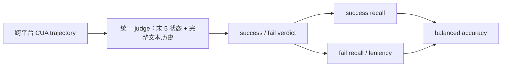
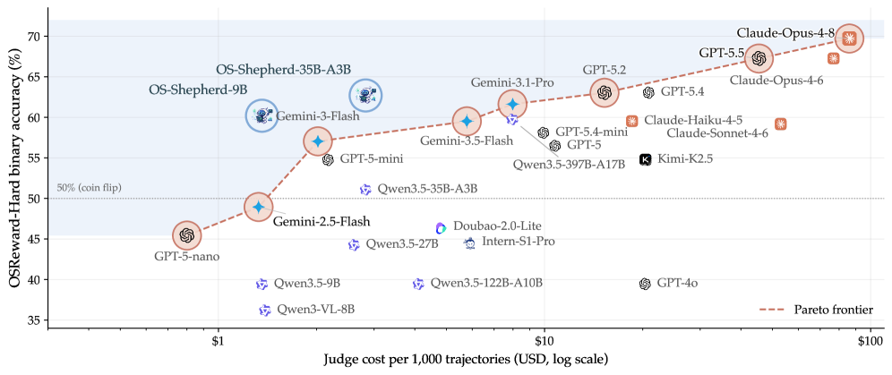

# OSReward：跨平台电脑操作 Reward Model 统一评测

> 本页实现论文的 success/fail 双类召回、balanced accuracy 与 leniency 审计协议；确定性 mini-suite 不冒充官方人工标注轨迹或 OS-Shepherd 模型训练。

## 论文信息

| 字段 | 内容 |
|---|---|
| 论文链接 | [OSReward（arXiv 2607.28609）](https://arxiv.org/abs/2607.28609) |
| 公司 / 机构 | The University of Hong Kong / Nanjing University / NUS / USTC / Xi’an Jiaotong University / University of Oxford / Fudan University |
| 首次公开日期 | 2026-07-30 |
| 原作者代码 | [项目主页：代码、benchmark、数据、权重](https://os-copilot.github.io/OSReward-Home/) |
| 本地 adapter / 算法键 | `os-shepherd`；benchmark `osreward-mini` |
| 本地复现代码 | [`src/auto_research/agent_research/osreward.py`](https://github.com/daiwk/auto-research/blob/main/src/auto_research/agent_research/osreward.py) |

## 原始论文总结

### 背景与主要改动

电脑操作 Agent 需要 reward model 判断完整轨迹是否真的完成任务，但普通 accuracy 会掩盖“几乎全判成功”的宽松偏差。OSReward 汇集 Windows、macOS、Ubuntu、Android 的人工验证任务与轨迹，同时发布 Hard 和 Multi 子集；统一报告 success recall、fail recall 与两者均值 balanced accuracy，并用 OS-Shepherd-100K 训练开放 9B/35B judge。



<!-- paper-figure:start -->
### 原论文关键图

[](https://arxiv.org/html/2607.28609v1/x3.png)

> **原论文 Figure 1（关键图）**：展示原论文方法的总体设计和关键组成。图片来自[原论文](https://arxiv.org/abs/2607.28609)，版权归原作者所有；点击图片可查看来源。
<!-- paper-figure:end -->

### 核心公式

$$
\mathrm{sRec}=\frac{TP}{TP+FN},\qquad
\mathrm{fRec}=\frac{TN}{TN+FP},\qquad
\mathrm{BalAcc}=\frac{\mathrm{sRec}+\mathrm{fRec}}{2}.
$$

### 论文离线与线上效果

官方 OSReward 含 1,019 条轨迹。最强闭源 judge 的 accuracy 约 89.7%，而多数模型存在把失败轨迹判成成功的 leniency bias；OS-Shepherd-9B 在主集达到 86.1% accuracy / 86.3% balanced accuracy，论文报告其成本比前沿商业 judge 低 30–60 倍。该工作是公开评测与模型训练，不涉及生产线上 A/B。

## 本地复现

本地 `osreward-mini` 覆盖四个平台与四类任务，显式区分“界面有活动”“有完成证据”和“仍有未完成要求”。判分器不能只信 Agent 的成功声明；120-episode seed 42 的 success recall、fail recall、balanced accuracy 均为 1.0，leniency rate 为 0。这里是确定性协议验收，不代表 learned VLM judge 在官方数据上的泛化分数。

```bash
auto-research agent-eval --method os-shepherd --benchmark osreward-mini --episodes 120 --seed 42
```

固定 seed 指标见 [`latest-20260802-seed42.json`](../../experiments/latest-20260802-seed42.json)。

## 复现边界

本地没有下载官方截图轨迹或训练 9B/35B VLM judge，只把论文最重要的评测契约变成可执行基础设施。结果不能与官方模型表直接比较。
