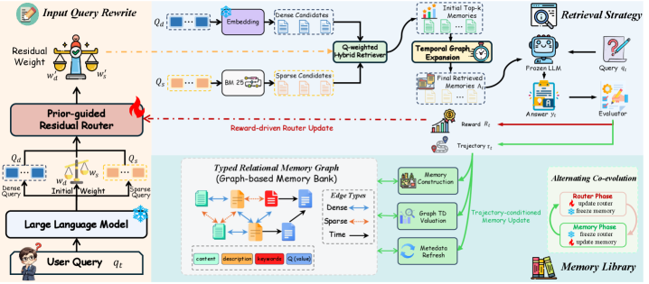

# CoEvo-Mem：检索路由与记忆库交替共进化

> **Fidelity：核心机制复现**。本页把原论文结论、本地机制验证和未复刻部分分开陈述。

## 论文信息

| 字段 | 内容 |
|---|---|
| 论文链接 | [CoEvo-Mem: Co-Evolving Retrieval Policy and Memory Bank for LLM Agents（arXiv 2608.01739）](https://arxiv.org/abs/2608.01739) |
| 公司 / 机构 | 论文未列机构 |
| 首次公开日期 | 2026-08-03（arXiv v1） |
| 原作者代码 | 未发现/未发布官方代码（核查日期：2026-08-08） |
| 本地 adapter / 方法键 | `coevo-mem` |
| 本地复现代码 | [`src/auto_research/agent_research/`](https://github.com/daiwk/auto-research/tree/main/src/auto_research/agent_research/) |

## 原始论文总结

### 背景与主要改动

只优化 query routing 或只更新 memory bank 会忽略二者反馈环。CoEvo-Mem 让冻结 LLM 生成 route-specific rewrite 和 prior，轻量 residual router 在线修正；任务结果更新路由，轨迹反馈更新 memory value 与 graph relation，并交替冻结一侧控制非平稳性。


<!-- paper-figure:start -->
### 原论文关键图

[](https://arxiv.org/html/2608.01739v1/x1.png)

> **原论文 Figure 2（关键图）**：展示原论文的训练流程与关键优化环节。图片来自[原论文](https://arxiv.org/abs/2608.01739)，版权归原作者所有；点击图片可查看来源。
<!-- paper-figure:end -->

### 核心公式

$$
q'=q_{LLM}+\Delta_\phi(q),\quad \phi\leftarrow\arg\max J(\phi;M\ \mathrm{fixed}),\quad M\leftarrow\operatorname{Update}(M;\tau,\phi\ \mathrm{fixed}).
$$

### 论文离线与线上效果

七个多样 benchmark 上达到 SOTA，验证 retrieval-memory co-evolution；无生产 A/B。

## 本地复现

实现 route rewrite、残差路由与 router/memory bank 交替更新；检索键包含任务轴和工具签名，防止跨任务误复用。

PlanBench mini-suite、120 episodes、seed 42：joint success **1.0000**，average cost 0.5000；论文特有操作均有非零 telemetry。

```bash
auto-research agent-eval --method coevo-mem --benchmark planbench-mini --episodes 120 --seed 42
auto-research evolve --model agent --dataset planbench-mini --direction "组合 coevo-mem 与已安装论文算子" --generations 2 --population 4
```

固定指标见 [`../../experiments/p0-p1-closed-audit-20260808-seed42.json`](../../experiments/p0-p1-closed-audit-20260808-seed42.json)。

## 复现边界

本地使用确定性公共 mini-suite 验证核心状态更新和公平预算，不等同于原论文大模型、多卡 RL、私有环境或完整 benchmark；本地相对变化不得与原文提升混写。
