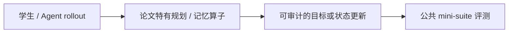
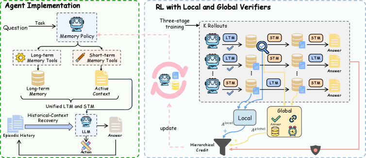

# VerMem：带局部和全局验证器的统一记忆管理

> **Fidelity：核心机制复现**。本页把原论文结论、本地机制验证和未复刻部分分开陈述。

## 论文信息

| 字段 | 内容 |
|---|---|
| 论文链接 | [Verifiable Memory: Learning Unified Memory Management with Local and Global Verifiers for Large Language Model Agents（arXiv 2608.03137）](https://arxiv.org/abs/2608.03137) |
| 公司 / 机构 | Sun Yat-sen University / Xiaolong Sun |
| 首次公开日期 | 2026-08-04（arXiv v1） |
| 原作者代码 | [已开源：Sun-SYSU-24/VerMem](https://github.com/Sun-SYSU-24/VerMem) |
| 本地 adapter / 方法键 | `vermem` |
| 本地复现代码 | [`src/auto_research/agent_research/`](https://github.com/daiwk/auto-research/tree/main/src/auto_research/agent_research/) |

## 原始论文总结

### 背景与主要改动

长期记忆、活动上下文与 episodic history 往往分开优化，轨迹奖励无法判断单次记忆操作是否正确。VerMem 用一个策略管理三类状态和七种原子操作，以 local verifier 审核状态转移、global verifier 审核证据一致性。



<!-- paper-figure:start -->
### 原论文关键图

[](https://arxiv.org/html/2608.03137v1/x1.png)

> **原论文 Figure 1（关键图）**：展示原论文的训练流程与关键优化环节。图片来自[原论文](https://arxiv.org/abs/2608.03137)，版权归原作者所有；点击图片可查看来源。
<!-- paper-figure:end -->

### 核心公式

$$
R=R_{task}+\lambda_lV_{local}(m_t,a_t,m_{t+1})+\lambda_gV_{global}(M_T,\tau)-\lambda_cC(a_t),\quad \max_\pi\mathbb E_\pi[R].
$$

### 论文离线与线上效果

五个 benchmark、两个 backbone 上在绝大多数指标最好；受控 online-token budget 下给出最优效率—性能前沿。无生产 A/B。

## 本地复现

显式维护 LTM、active context、episodes，执行 retrieve/add/restore，并分别计数 local/global verifier。

PlanBench mini-suite、120 episodes、seed 42：joint success **1.0000**，average cost 0.6100；论文特有操作均有非零 telemetry。

```bash
auto-research agent-eval --method vermem --benchmark planbench-mini --episodes 120 --seed 42
auto-research evolve --model agent --dataset planbench-mini --direction "组合 vermem 与已安装论文算子" --generations 2 --population 4
```

固定指标见 [`../../experiments/p0-p1-closed-audit-20260808-seed42.json`](../../experiments/p0-p1-closed-audit-20260808-seed42.json)。

## 复现边界

本地使用确定性公共 mini-suite 验证核心状态更新和公平预算，不等同于原论文大模型、多卡 RL、私有环境或完整 benchmark；本地相对变化不得与原文提升混写。
