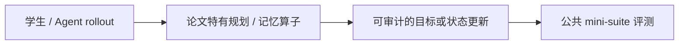
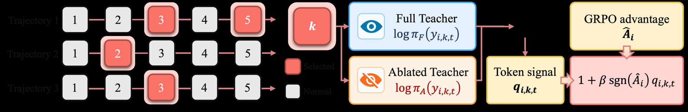

# OCSD：消除 replay scaffold 混杂的观测校准蒸馏

> **Fidelity：核心机制复现**。本页把原论文结论、本地机制验证和未复刻部分分开陈述。

## 论文信息

| 字段 | 内容 |
|---|---|
| 论文链接 | [Agentic Reinforcement Learning with Observation-Calibrated Self-Distillation（arXiv 2608.04788）](https://arxiv.org/abs/2608.04788) |
| 公司 / 机构 | Yi Yang 等（按一作归档） |
| 首次公开日期 | 2026-08-05（arXiv v1） |
| 原作者代码 | [已开源：yiy1x/OCSD](https://github.com/yiy1x/OCSD) |
| 本地 adapter / 方法键 | `ocsd` |
| 本地复现代码 | [`src/auto_research/agent_research/`](https://github.com/daiwk/auto-research/tree/main/src/auto_research/agent_research/) |

## 原始论文总结

### 背景与主要改动

直接重放未来 observation 时，token 分数变化同时来自观测信息和重放脚手架。OCSD 构造结构完全匹配的 Full 与 Observation-Ablated 两个 replay，仅以二者残差调制高不确定 step 的 GRPO 更新。



<!-- paper-figure:start -->
### 原论文关键图

[](https://arxiv.org/html/2608.04788v1/Figures/methodology_v6.png)

> **原论文 Figure 3（关键图）**：展示原论文提出的核心架构、主要模块及其连接关系。图片来自[原论文](https://arxiv.org/abs/2608.04788)，版权归原作者所有；点击图片可查看来源。
<!-- paper-figure:end -->

### 核心公式

$$
r_t=(\log\pi_{full}(y_t)-\log\pi_S(y_t))-(\log\pi_{abl}(y_t)-\log\pi_S(y_t)),\quad A'_{t}=A_{traj}(1+\lambda u_tr_t).
$$

### 论文离线与线上效果

在 ALFWorld、WebShop、Search-QA 和三个 Qwen3 规模上稳定超过强基线；摘要未给统一单值，无生产 A/B。

## 本地复现

执行 full/observation-ablated matched replay、residual calibration 和 turn-level credit。

PlanBench mini-suite、120 episodes、seed 42：joint success **1.0000**，average cost 1.0200；论文特有操作均有非零 telemetry。

```bash
auto-research agent-eval --method ocsd --benchmark planbench-mini --episodes 120 --seed 42
auto-research evolve --model agent --dataset planbench-mini --direction "组合 ocsd 与已安装论文算子" --generations 2 --population 4
```

固定指标见 [`../../experiments/p0-p1-closed-audit-20260808-seed42.json`](../../experiments/p0-p1-closed-audit-20260808-seed42.json)。

## 复现边界

本地使用确定性公共 mini-suite 验证核心状态更新和公平预算，不等同于原论文大模型、多卡 RL、私有环境或完整 benchmark；本地相对变化不得与原文提升混写。
