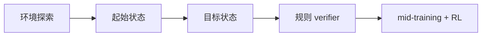
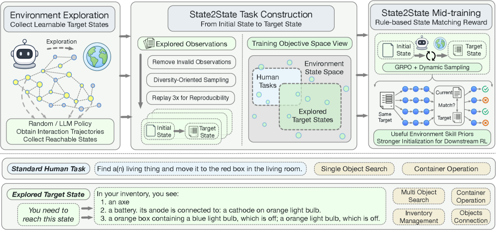

# State2State: Environment-Derived Mid-Training for LLM Agents

> **复现级别：核心机制 mini-suite。** 本地实现执行论文特有的 环境派生中训练 算子；不把确定性小型评测写成论文完整复现。

## 论文信息

| 字段 | 内容 |
|---|---|
| 论文链接 | [arXiv 2608.04934](https://arxiv.org/abs/2608.04934) |
| 公司/机构/学校 | Tsinghua University AIR / Alibaba Group |
| 首次公开日期 | 2026-08-05（arXiv v1） |
| 原文开源代码 | 是：[https://github.com/THUNLP-MT/State2State](https://github.com/THUNLP-MT/State2State) |
| Adapter | `state2state` |
| 本地复现代码 | [`src/auto_research/agent_research/latest_20260809.py`](https://github.com/daiwk/auto-research/blob/main/src/auto_research/agent_research/latest_20260809.py) |

## 原始论文总结

### 背景与主要改动

**主题：环境派生中训练。** 从环境探索自动采样起点与目标状态，用规则化状态匹配做 verifier，形成无需人工任务与专家轨迹的可扩展 mid-training。

### 主要架构



<!-- paper-figure:start -->
### 原论文关键图

[](https://arxiv.org/html/2608.04934v1/x2.png)

> **原论文 Figure 2（关键图）**：展示原论文的训练流程与关键优化环节。图片来自[原论文](https://arxiv.org/abs/2608.04934)，版权归原作者所有；点击图片可查看来源。
<!-- paper-figure:end -->

### 核心公式

$\tau\sim\pi(\cdot\mid s_0),\quad R=\mathbf 1[T(s_T)=T(s^*)]$

### 论文离线效果

ALFWorld 与 ScienceWorld 多数设置提升；作为下游 RL 初始化时继续改善最终效果与样本效率。

## 本地复现

稳定指标保存在本论文目录的 [`metrics/planbench-mini-seed42.json`](metrics/planbench-mini-seed42.json)，不提交 checkpoint 或原始运行目录。

```bash
auto-research agent-research --method state2state --benchmark planbench-mini --episodes 120 --seed 42
```

> **本地对照口径**：`state2state` 与同一公开 mini-suite 的无该机制控制组比较；仅报告本地产物中的指标，不把原文大模型/真实环境结果移植为本地提升。

## 复现边界

- 复现论文特有的状态、信用或选择算子，而非只改方法名。
- 未运行原文大模型、专有环境或昂贵 judge；这些缺口不会标注为“已接入”。
- `state2state` 已加入统一 evolve 候选发现；组合 genome 仍受公共评测与预算约束。
