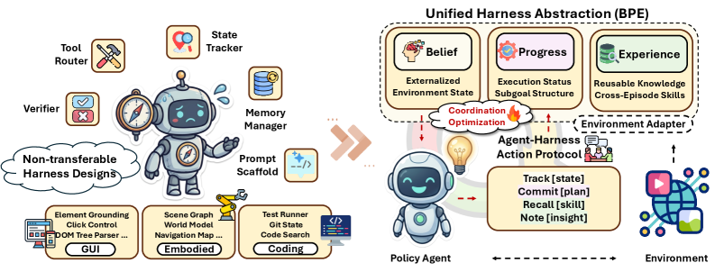

# EvoHarness-RL: Learning Self-Evolving Runtime Harness for Long-Horizon LLM Agents

> **复现级别：核心机制 mini-suite。** 本地实现执行论文特有的 Harness policy RL 算子；不把确定性小型评测写成论文完整复现。

## 论文信息

| 字段 | 内容 |
|---|---|
| 论文链接 | [arXiv 2608.05446](https://arxiv.org/abs/2608.05446) |
| 公司/机构/学校 | University of Illinois Urbana–Champaign / Meta AI |
| 首次公开日期 | 2026-08-05（arXiv v1） |
| 原文开源代码 | 否：未发现原作者公开代码（核查日期：2026-08-09） |
| Adapter | `evoharness-rl` |
| 本地复现代码 | [`src/auto_research/agent_research/latest_20260809.py`](https://github.com/daiwk/auto-research/blob/main/src/auto_research/agent_research/latest_20260809.py) |

## 原始论文总结

### 背景与主要改动

**主题：Harness policy RL。** 把 Belief、Progress、Experience 暴露为策略可操作的外部状态；先 SFT 学会 harness action，再以成本感知 GRPO 学习何时读写和合并。

### 主要架构


<!-- paper-figure:start -->
### 原论文关键图

[](https://arxiv.org/html/2608.05446v1/x1.png)

> **原论文 Figure 1（关键图）**：展示原论文提出的核心架构、主要模块及其连接关系。图片来自[原论文](https://arxiv.org/abs/2608.05446)，版权归原作者所有；点击图片可查看来源。
<!-- paper-figure:end -->

### 核心公式

$R=R_{task}-\lambda C_{harness}$

### 论文离线效果

Qwen3-8B 在 ALFWorld 达到 96.9% success，并观察到 harness annealing 与 harness evolution。

## 本地复现

稳定指标保存在本论文目录的 [`metrics/planbench-mini-seed42.json`](metrics/planbench-mini-seed42.json)，不提交 checkpoint 或原始运行目录。

```bash
auto-research agent-research --method evoharness-rl --benchmark planbench-mini --episodes 120 --seed 42
```

> **本地对照口径**：`evoharness-rl` 与同一公开 mini-suite 的无该机制控制组比较；仅报告本地产物中的指标，不把原文大模型/真实环境结果移植为本地提升。

## 复现边界

- 复现论文特有的状态、信用或选择算子，而非只改方法名。
- 未运行原文大模型、专有环境或昂贵 judge；这些缺口不会标注为“已接入”。
- `evoharness-rl` 已加入统一 evolve 候选发现；组合 genome 仍受公共评测与预算约束。
