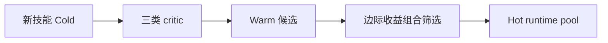
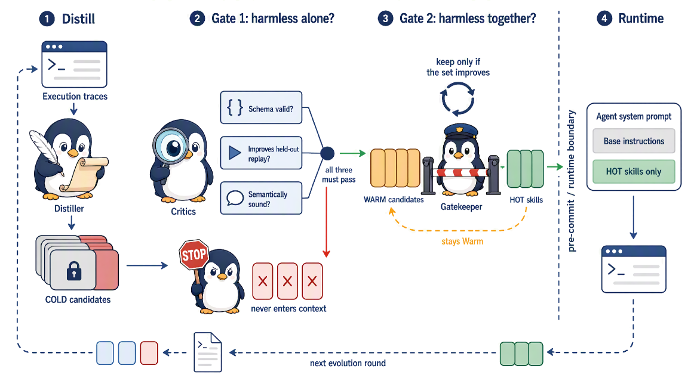

# When Self-Evolution Backfires: Pre-Commit Gating against Skill Contamination in LLM Agents

> **复现级别：核心机制 mini-suite。** 本地实现执行论文特有的 技能进化安全 算子；不把确定性小型评测写成论文完整复现。

## 论文信息

| 字段 | 内容 |
|---|---|
| 论文链接 | [arXiv 2608.05810](https://arxiv.org/abs/2608.05810) |
| 公司/机构/学校 | 论文未列机构 |
| 首次公开日期 | 2026-08-06（arXiv v1） |
| 原文开源代码 | 否：未发现原作者公开代码（核查日期：2026-08-09） |
| Adapter | `vag` |
| 本地复现代码 | [`src/auto_research/agent_research/latest_20260809.py`](https://github.com/daiwk/auto-research/blob/main/src/auto_research/agent_research/latest_20260809.py) |

## 原始论文总结

### 背景与主要改动

**主题：技能进化安全。** 技能一旦进入上下文会污染后代，事后删除无法彻底回滚。VaG 在写入前依次做结构、行为无害性、语义一致性验证，再以边际收益选择可共同使用的 Hot 技能集合。

### 主要架构



<!-- paper-figure:start -->
### 原论文关键图

[](https://arxiv.org/html/2608.05810v1/x2.png)

> **原论文 Figure 2（关键图）**：展示原论文的整体流程、关键阶段及其数据流向。图片来自[原论文](https://arxiv.org/abs/2608.05810)，版权归原作者所有；点击图片可查看来源。
<!-- paper-figure:end -->

### 核心公式

$M_r=M_{r-1}\cup G(S_r),\quad f(H)=\mathbb E[R(agent\oplus H)]$

### 论文离线效果

Terminal-Bench 2 五轮单调升至 72% pass@1；技能池约小 5×，相对 ungated 最佳轮仍高 10pp。

## 本地复现

稳定指标保存在本论文目录的 [`metrics/planbench-mini-seed42.json`](metrics/planbench-mini-seed42.json)，不提交 checkpoint 或原始运行目录。

```bash
auto-research agent-research --method vag --benchmark planbench-mini --episodes 120 --seed 42
```

> **本地对照口径**：`vag` 与同一公开 mini-suite 的无该机制控制组比较；仅报告本地产物中的指标，不把原文大模型/真实环境结果移植为本地提升。

## 复现边界

- 复现论文特有的状态、信用或选择算子，而非只改方法名。
- 未运行原文大模型、专有环境或昂贵 judge；这些缺口不会标注为“已接入”。
- `vag` 已加入统一 evolve 候选发现；组合 genome 仍受公共评测与预算约束。
