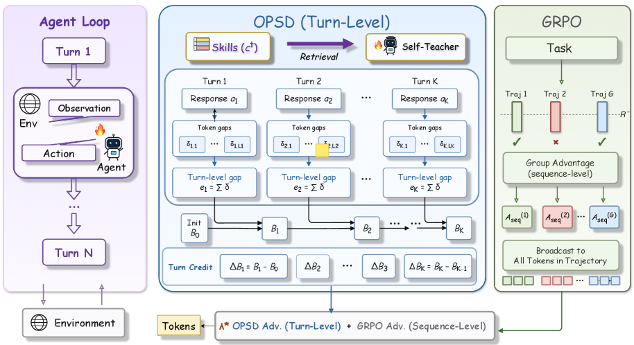

# AgentOPSD：递归贝叶斯关键 turn 信用分配

> **Fidelity：核心机制复现**。本页把原论文结论、本地机制验证和未复刻部分分开陈述。

## 论文信息

| 字段 | 内容 |
|---|---|
| 论文链接 | [AgentOPSD: Recursive Self-Distillation for Agentic Reinforcement Learning（arXiv 2608.05987）](https://arxiv.org/abs/2608.05987) |
| 公司 / 机构 | Tsinghua University / Zhejiang University / Meituan |
| 首次公开日期 | 2026-08-06（arXiv v1） |
| 原作者代码 | [仓库已公开：ZethWang/AgentOPSD；README 标注完整代码待发布](https://github.com/ZethWang/AgentOPSD) |
| 本地 adapter / 方法键 | `agent-opsd` |
| 本地复现代码 | [`src/auto_research/agent_research/`](https://github.com/daiwk/auto-research/tree/main/src/auto_research/agent_research/) |

## 原始论文总结

### 背景与主要改动

轨迹奖励难定位少数关键决策。AgentOPSD 把 privileged replay 的 token teacher/student log-prob gap 聚合成 turn evidence，再在 log-odds 空间递归更新成功信念，以相邻信念修订量识别 pivotal turn。


<!-- paper-figure:start -->
### 原论文关键图

[](https://arxiv.org/html/2608.05987v1/x2.png)

> **原论文 Figure 2（关键图）**：展示原论文方法的总体设计和关键组成。图片来自[原论文](https://arxiv.org/abs/2608.05987)，版权归原作者所有；点击图片可查看来源。
<!-- paper-figure:end -->

### 核心公式

$$
e_t=\sum_{j\in turn_t}(\log\pi_T(y_j)-\log\pi_S(y_j)),\quad \ell_t=\ell_{t-1}+e_t,\quad c_t=\sigma(\ell_t)-\sigma(\ell_{t-1}).
$$

### 论文离线与线上效果

Qwen2.5-7B 在 ALFWorld 达到 89.1% success，并超过 GRPO 与自蒸馏基线；无生产 A/B。

## 本地复现

实现逐 turn evidence、递归 log-odds belief、pivotal revision 和 critic-free policy update。

PlanBench mini-suite、120 episodes、seed 42：joint success **1.0000**，average cost 0.9000；论文特有操作均有非零 telemetry。

```bash
auto-research agent-eval --method agent-opsd --benchmark planbench-mini --episodes 120 --seed 42
auto-research evolve --model agent --dataset planbench-mini --direction "组合 agent-opsd 与已安装论文算子" --generations 2 --population 4
```

固定指标见 [`../../experiments/p0-p1-closed-audit-20260808-seed42.json`](../../experiments/p0-p1-closed-audit-20260808-seed42.json)。

## 复现边界

本地使用确定性公共 mini-suite 验证核心状态更新和公平预算，不等同于原论文大模型、多卡 RL、私有环境或完整 benchmark；本地相对变化不得与原文提升混写。
