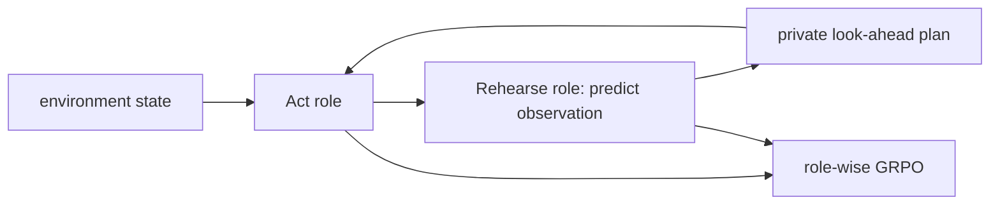
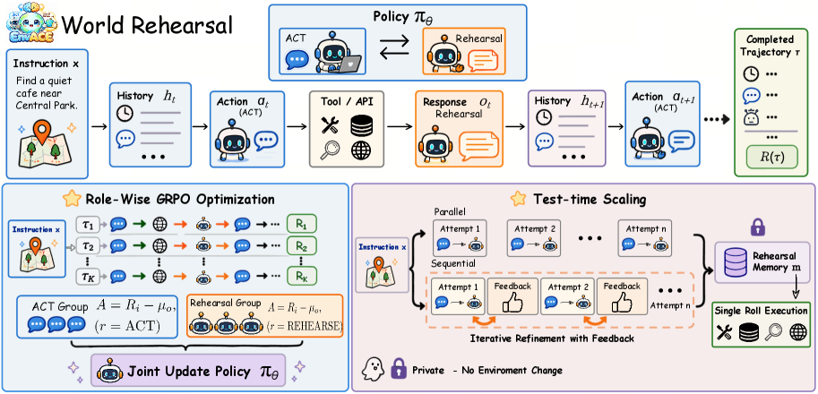

# EnvACE：Act 与环境 Rehearsal 双角色 Agent RL

> **Fidelity：核心机制复现**。同一策略交替 act/rehearse，rehearsal observation 仅作私有规划状态，并执行 role-wise group advantage。

## 论文信息

| 字段 | 内容 |
|---|---|
| 论文链接 | [EnvACE（arXiv 2608.06197）](https://arxiv.org/abs/2608.06197) |
| 公司 / 机构 | Shanghai Jiao Tong / Zhejiang / NUS / SYSU / CSU / CUHK / Tencent |
| 首次公开日期 | 2026-08-06（arXiv v1） |
| 原作者代码 | [已开源：Within-yao/EnvACE](https://github.com/Within-yao/EnvACE) |
| 本地 adapter / 方法键 | `envace` |
| 本地复现代码 | [`src/auto_research/agent_research/`](https://github.com/daiwk/auto-research/tree/main/src/auto_research/agent_research/) |

## 原始论文总结

### 背景与主要改动

EnvACE 不另训 world model，而让同一个 agent policy 在真实 act 之间切换到 rehearsal role，自行预测下一 observation；训练时分别为 acting 与 rehearsal 轨迹计算 group-relative advantage，避免两种奖励尺度互相污染，测试时可用少量私有 rehearsal 扩展规划。



<!-- paper-figure:start -->
### 原论文关键图

[](https://arxiv.org/html/2608.06197v1/x4.png)

> **原论文 Figure 2（关键图）**：展示原论文的训练流程与关键优化环节。图片来自[原论文](https://arxiv.org/abs/2608.06197)，版权归原作者所有；点击图片可查看来源。
<!-- paper-figure:end -->

### 核心公式

$$
A_i^{(r)}=R_i^{(r)}-\frac1{|G_r|}\sum_{j\in G_r}R_j^{(r)},\qquad
\mathcal L=-\sum_{r\in\{act,rehearse\}}\mathbb E_i[A_i^{(r)}\log\pi_\theta(\tau_i^{(r)})].
$$

### 论文离线与线上效果

论文总体分 32.91；test-time N=2 rehearsal 的 overall 为 **40.9**，对照为 36.7。无生产 A/B。

## 本地复现

PlanBench mini-suite 120 episodes：joint success 1.0000，执行 360 次 world rehearsal、720 次 role-wise advantage update；`real_tool_responses=0`，确保预测 observation 没被伪装成真实环境反馈。

```bash
auto-research agent-eval --method envace --benchmark planbench-mini --episodes 120 --seed 42
auto-research evolve --model agent --dataset planbench-mini --direction "比较 EnvACE act/rehearse 与 role-wise GRPO" --generations 2 --population 4
```

固定指标见 [`../../experiments/envace-planbench-seed42.json`](../../experiments/envace-planbench-seed42.json)。

## 复现边界

确定性 mini-suite 验证状态路由与计数，不等同于论文浏览器/工具环境和大模型 RL 训练。
