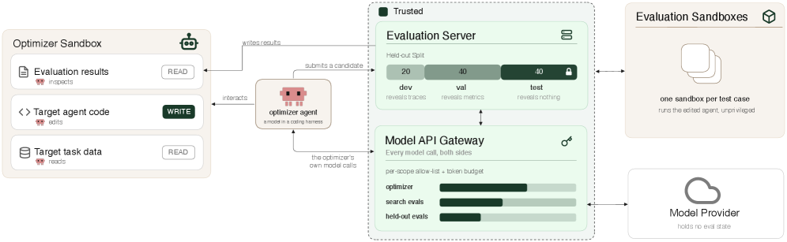

# HarnessOpt-Bench: Evaluating LLMs at Harness Optimization

> **复现级别：核心机制 mini-suite。** 本地实现执行论文特有的 Harness 优化评测 算子；不把确定性小型评测写成论文完整复现。

## 论文信息

| 字段 | 内容 |
|---|---|
| 论文链接 | [arXiv 2608.06301](https://arxiv.org/abs/2608.06301) |
| 公司/机构/学校 | Scale AI |
| 首次公开日期 | 2026-08-06（arXiv v1） |
| 原文开源代码 | 否：未发现原作者公开代码（核查日期：2026-08-09） |
| Adapter | `harnessopt-bench` |
| 本地复现代码 | [`src/auto_research/agent_research/latest_20260809.py`](https://github.com/daiwk/auto-research/blob/main/src/auto_research/agent_research/latest_20260809.py) |

## 原始论文总结

### 背景与主要改动

**主题：Harness 优化评测。** 在固定 target-evaluation 预算下，让优化器修改 prompt、工具、控制流和记忆；隐藏测试集与可信执行环境隔离搜索反馈，保留候选版本以供审计。

### 主要架构


<!-- paper-figure:start -->
### 原论文关键图

[](https://arxiv.org/html/2608.06301v1/x1.png)

> **原论文 Figure 1（关键图）**：展示原论文方法的总体设计和关键组成。图片来自[原论文](https://arxiv.org/abs/2608.06301)，版权归原作者所有；点击图片可查看来源。
<!-- paper-figure:end -->

### 核心公式

$Score=(J(h^*)-J(h_0))/\max(|J(h_0)|,\epsilon)$

### 论文离线效果

5 个前沿模型、4 个下游任务、111 次计分运行表明模型差异大于 coding harness 差异，native harness 并非稳定更优。

## 本地复现

稳定指标保存在本论文目录的 [`metrics/planbench-mini-seed42.json`](metrics/planbench-mini-seed42.json)，不提交 checkpoint 或原始运行目录。

```bash
auto-research agent-research --method harnessopt-bench --benchmark planbench-mini --episodes 120 --seed 42
```

> **本地对照口径**：`harnessopt-bench` 与同一公开 mini-suite 的无该机制控制组比较；仅报告本地产物中的指标，不把原文大模型/真实环境结果移植为本地提升。

## 复现边界

- 复现论文特有的状态、信用或选择算子，而非只改方法名。
- 未运行原文大模型、专有环境或昂贵 judge；这些缺口不会标注为“已接入”。
- `harnessopt-bench` 已加入统一 evolve 候选发现；组合 genome 仍受公共评测与预算约束。
