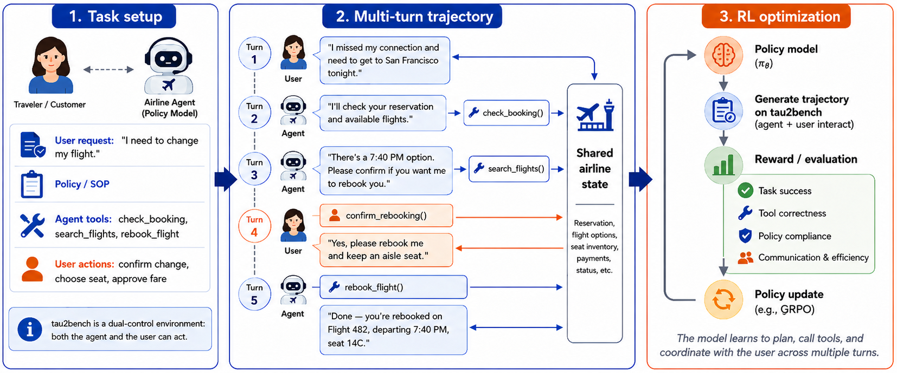

# SinkFlex-RL：面向长轨迹工具 Agent 的显存友好 RL

> **复现级别：核心机制 mini-suite。** 本地实际执行 sink 保留、causal sliding window 和无 critic 的 group-relative 更新路径；未声称复刻 CUDA FlexAttention kernel。

## 论文信息

| 字段 | 内容 |
|---|---|
| 论文链接 | [arXiv 2608.10357](https://arxiv.org/abs/2608.10357) |
| 公司 / 机构 | Capital One AI Foundations |
| 首次公开日期 | 2026-08-11（arXiv v1） |
| 原作者代码 | 否：未发现原作者公开代码（核查日期：2026-08-13） |
| 本地 adapter / 方法 | `sinkflex-rl` |
| 本地复现代码 | [`src/auto_research/agent_research/latest_20260813.py`](https://github.com/daiwk/auto-research/blob/main/src/auto_research/agent_research/latest_20260813.py) |

## 原始论文总结

### 背景与主要改动

长程工具 Agent 的 on-policy rollout 同时受环境状态、长上下文和训练显存限制。SinkFlex-RL 把 Gymnasium 双控制环境、VERL 风格数据流、无 value model 的 GRPO 与 sink-aware FlexAttention 组合，causal / sliding-window mask 下仍保留模型特有 sink scaling。


<!-- paper-figure:start -->
### 原论文关键图

[](https://arxiv.org/html/2608.10357v1/agentic_rl_framework.png)

> **原论文 Figure 1（关键图）**：展示原论文方法的总体设计和关键组成。图片来自[原论文](https://arxiv.org/abs/2608.10357)，版权归原作者所有；点击图片可查看来源。
<!-- paper-figure:end -->

### 核心公式

$$
L_{GRPO}=-\frac{1}{\sum_iT_i}\sum_{i,t}\min(\rho_{i,t}\hat A_i,\operatorname{clip}(\rho_{i,t},1-\epsilon,1+\epsilon)\hat A_i)+\beta D_{KL}(\pi_\theta\Vert\pi_{ref}).
$$

### 论文离线与线上效果

τ²-Bench retail validation reward 从 0.25 升至 0.44；4096 tokens 峰值显存从 28.06 GB 降到 22.52 GB（**-19.7%**），8192 tokens 使用 25.53 GB，而 eager baseline OOM。
论文报告离线 Agent benchmark 与显存实验，没有工业线上 A/B。

## 本地复现

ScaleMCP mini-suite 120 episodes：joint success 1.0、average cost 0.67；sink/window 路径执行 120 次 policy update，并压缩长上下文。固定指标见 [`metrics/scalemcp-mini-seed42.json`](metrics/scalemcp-mini-seed42.json)。
本轮跨主题运行入口见 [`mr7-latest-20260813-seed42.json`](../../experiments/mr7-latest-20260813-seed42.json)；该文件只索引各论文独立指标，不复制指标值。

```bash
auto-research agent-eval --method sinkflex-rl --benchmark scalemcp-mini --episodes 120 --seed 42
```

## 复现边界

未复刻论文的 MoE checkpoint、VERL 集群、τ²-Bench 全环境或 GPU kernel 显存曲线；mini-suite 验证状态保留规则与 RL 控制流，GPU 性能数字仅引用原文。
