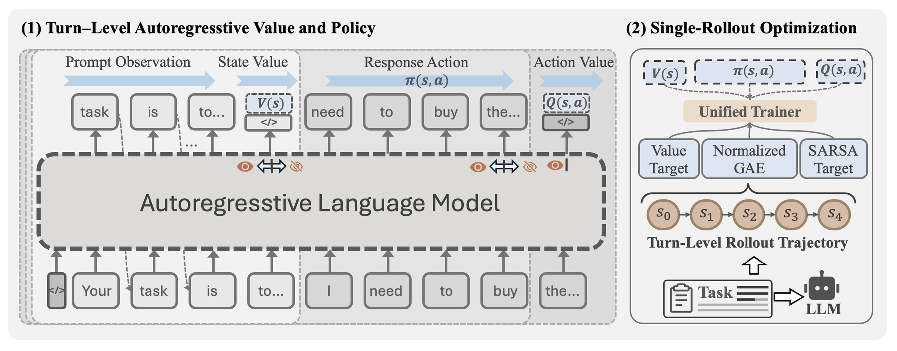

# SAPO: Single-Rollout Autoregressive Policy Optimization for Agentic Reinforcement Learning

> **复现级别：核心 Agent 机制 mini-suite。** 本地实现独立规划、记忆、credit assignment 或拓扑路径，并在确定性任务上记录过程计数；不是原论文完整外部环境。

## 论文信息

| 字段 | 内容 |
|---|---|
| 论文链接 | [arXiv 2608.19842](https://arxiv.org/abs/2608.19842) |
| 公司 / 机构 | Xiamen University |
| 第一作者 | Dayang Liang |
| 首次公开日期 | 2026-08-20（arXiv v1） |
| 原作者代码 | 未发现原作者公开代码（截至 2026-08-24） |
| 本地 adapter / 方法 | `sapo` |
| 本地复现代码 | `src/auto_research/agent_research/historical_b10_b11.py` |

## 原始论文总结

### 背景与主要改动

同一自回归骨干在不同因果边界输出 policy/value，结合 PPO、on-policy SARSA 和 trajectory GAE。


<!-- paper-figure:start -->
### 原论文关键图

[](https://arxiv.org/html/2608.19842v1/sapo_fw.png)

> **原论文 Figure 1（关键图）**：展示原论文提出的核心架构、主要模块及其连接关系。图片来自[原论文](https://arxiv.org/abs/2608.19842)，版权归原作者所有；点击图片可查看来源。
<!-- paper-figure:end -->

### 核心公式

$$
\hat A_t^{GAE}=\sum_{l\ge0}(\gamma\lambda)^l\delta_{t+l}
$$

### 论文离线与线上效果

ALFWorld/WebShop 平均超过 PPO 15.1 points、GRPO 12.1 points；迭代时间较 PPO -33.2%。 以上是原文结果，不将本地 mini-suite 推广成原论文 benchmark 或线上结论。

## 本地复现

在 planbench-mini 120 episodes 上，`sapo` joint success 为 `1.0000`、average cost `0.6200`；long-context 对照分别为 `1.0000` 与 `64.5000`。正确率饱和时重点核验 trace、source 和论文专属诊断计数，而不虚构效果提升。单篇指标见 [`metrics/planbench-mini-seed42.json`](metrics/planbench-mini-seed42.json)，批次索引见 [`../../experiments/historical-b07-b11-seed42.json`](../../experiments/historical-b07-b11-seed42.json)。

```bash
auto-research agent-research --method sapo --benchmark planbench-mini --episodes 120 --seed 42
```

## 复现边界

确定性 mini-suite 不访问真实浏览器、AppWorld、SWE-bench 或外部工具服务；它验证机制分支、过程状态和报告契约可执行。完整环境结果需按原文资源另行复现。运行目录是 `runs/agent-research/`，仓库只保存指标。另见 [`../../experiments/`](../../experiments/)。
