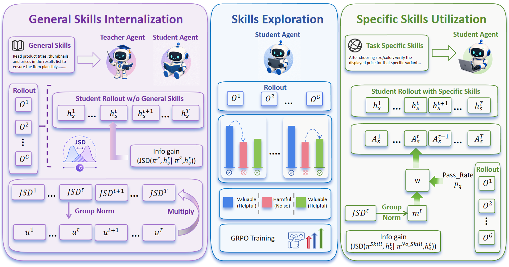

# AUSO：从技能内化到动作级技能利用

> **复现级别：核心机制 mini-suite。** 本地实际执行技能内化、无技能/有技能动作分布 JSD、bounded utilization weight 和复用阶段切换。

## 论文信息

| 字段 | 内容 |
|---|---|
| 论文链接 | [arXiv 2608.21292](https://arxiv.org/abs/2608.21292) |
| 公司 / 机构 | University of Science and Technology of China |
| 首次公开日期 | 2026-08-21（arXiv v1） |
| 原作者代码 | 是：[Action-Skill](https://github.com/JordanSancholhz/Action-Skill) |
| 本地 adapter / 方法 | `auso` |
| 本地复现代码 | [`src/auto_research/agent_research/latest_20260824.py`](https://github.com/daiwk/auto-research/blob/main/src/auto_research/agent_research/latest_20260824.py) |

## 原始论文总结

### 背景与主要改动

外部技能检索有上下文开销，完全内化又失去按任务选择能力；按整条轨迹成功率硬切阶段还无法判断某一个动作是否真正受益。AUSO 先用 skill-conditioned teacher 内化通用技能，再进行 outcome-driven exploration，最后对每个动作比较有技能和无技能策略的 JSD，以有界权重调整 GRPO advantage。


<!-- paper-figure:start -->
### 原论文关键图

[](https://arxiv.org/html/2608.21292v1/figure/model.png)

> **原论文 Figure 2（关键图）**：展示原论文方法的总体设计和关键组成。图片来自[原论文](https://arxiv.org/abs/2608.21292)，版权归原作者所有；点击图片可查看来源。
<!-- paper-figure:end -->

### 核心公式

$$
D_t=\operatorname{JSD}(\pi(\cdot\mid h_t,S)\,\|\,\pi(\cdot\mid h_t)),
\qquad
w_t=1+\beta(s)g(p_q)m_t,
$$

且 $1-\beta\le w_t\le1+\beta$，因此不会翻转原 trajectory advantage 的符号。

### 论文离线与线上效果

论文在 ALFWorld、WebShop、SearchQA 上报告提升；ALFWorld ID/OOD success 为 `94.3/67.9`，移除 action-level internalization 后为 `85.1/54.7`；SearchQA overall `47.5`，SkillRL 为 `47.1`。论文没有工业线上 A/B。

## 本地复现

> **本地对照口径**：基线为同一 PlanBench-mini、120 episodes 的 SkillRise；实验组 AUSO 保持 joint success `1.0`，平均成本从 `0.6550` 降到 `0.5955`，相对 **-9.09%**。

AUSO 创建 12 个技能、复用 108 次，并完成 108 次动作级 policy update。单篇稳定指标见 [`metrics/planbench-mini-seed42.json`](metrics/planbench-mini-seed42.json)，本批次统一索引见 [`../../experiments/recent-papers-20260824-seed42.json`](../../experiments/recent-papers-20260824-seed42.json)。

```bash
auto-research agent-eval --method auso --benchmark planbench-mini --episodes 120 --seed 42
```

## 复现边界

未运行 ALFWorld/WebShop/SearchQA、大模型 token rollout 或完整 GRPO；确定性 mini-suite 验证 progressive lifecycle、JSD 信息增益和 bounded reweighting 的控制流，不把成本代理指标冒充论文成功率。

## 统一 L2 无 Oracle 结果

在 `toolroute-l2-v1`、60 episodes/seed、seeds 42/43/44 上，AUSO 的 joint
success 为 **1.0000**、plan step F1 为 **0.9367**、故障恢复率为 **1.0000**，
平均成本 **4.0833**。指标见
[`metrics/toolroute-l2-seeds42-44.json`](metrics/toolroute-l2-seeds42-44.json)，统一口径见
[L2 能力评测](../capability-benchmark.md)。
