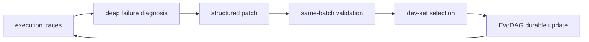
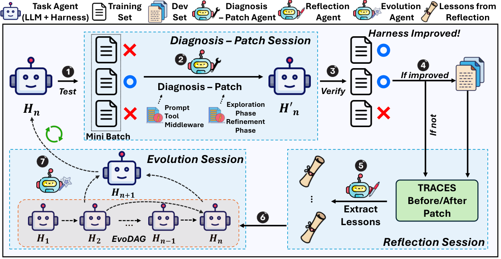

# AutoSaddler：从失败轨迹自动优化 Agent harness

> **复现级别：核心机制 mini-suite。** 实际执行深度失败诊断、结构化 patch、局部/held-out 验证和 durable harness 更新。

## 论文信息

| 字段 | 内容 |
|---|---|
| 论文链接 | [arXiv 2608.23041](https://arxiv.org/abs/2608.23041) |
| 公司 / 机构 | Microsoft / POSTECH（第一作者工作于 Microsoft 实习期间完成） |
| 首次公开日期 | 2026-08-24（arXiv v1） |
| 原作者代码 | 未找到公开源码；论文仅给出[项目页](https://aka.ms/AutoSaddler-website) |
| 本地 adapter / 方法 | `autosaddler` |
| 本地复现代码 | [`src/auto_research/agent_research/latest_20260825.py`](https://github.com/daiwk/auto-research/blob/main/src/auto_research/agent_research/latest_20260825.py) |

## 原始论文总结

### 背景与主要改动

长任务中 prompt、tool configuration 和 middleware 的小错误会累积，而人工调 harness 成本高。AutoSaddler 把 harness 当代码：从 mini-batch 失败 trace 做深度诊断，生成有边界的结构化 patch，在同 batch 检查因果效果，再用 dev set 选更新并写入 EvoDAG，形成可持续版本。



<!-- paper-figure:start -->
### 原论文关键图

[](https://arxiv.org/html/2608.23041v1/main_figure_revised.png)

> **原论文 Figure 2（关键图）**：展示原论文方法的总体设计和关键组成。图片来自[原论文](https://arxiv.org/abs/2608.23041)，版权归原作者所有；点击图片可查看来源。
<!-- paper-figure:end -->

### 核心公式

$$
J(\theta)=\mathbb E_{(x,y^*)\sim\mathcal T}
\mathbb E_{(\tau,\hat y)\sim P_\theta(\cdot\mid x)}[\mu(\hat y,y^*)],
\qquad \hat\theta=\arg\max_{\theta\in\mathcal V_{K,dev}}\hat J_{D_{dev}}(\theta).
$$

### 论文离线与线上效果

相对对应 base harness，GAIA2、SWE-Bench Pro、Terminal-Bench 2.0 分别提升 **9.0 / 9.6 / 10.0 points**。消融显示 deep diagnosis、targeted modification 与 generalization-aware selection 都必要；无工业线上 A/B。

## 本地复现

PlanBench-mini、120 episodes、seed 42：joint success **1.0000**，12 次 failure diagnosis 与 durable update、108 次复用，平均成本 **0.5440**。指标见 [`metrics/planbench-mini-seed42.json`](metrics/planbench-mini-seed42.json)。

本批次统一索引见 [`../../experiments/latest-20260825-seed42.json`](../../experiments/latest-20260825-seed42.json)。

```bash
auto-research agent-eval --method autosaddler --benchmark planbench-mini --episodes 120 --seed 42
```

## 复现边界

没有运行 GAIA2、SWE-Bench Pro、Terminal-Bench 2.0 或论文的生产 harness；本地只验证优化循环、验证边界和 durable reuse。
