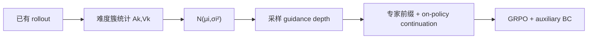
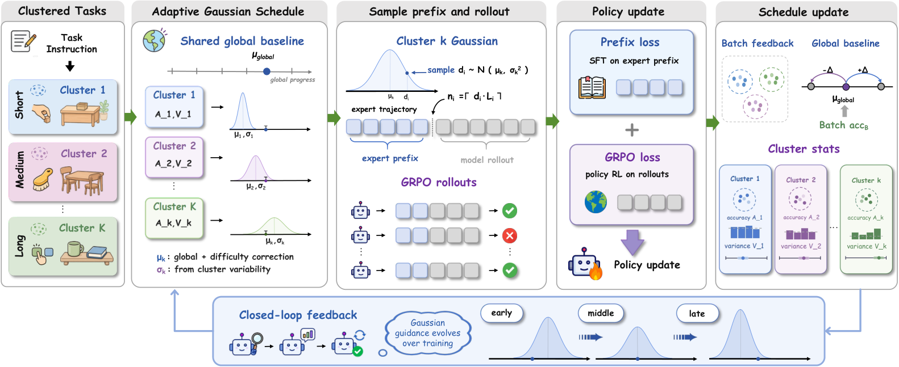

# Agent-G²：在线估计高斯 guidance 深度

> **复现级别：核心机制 mini-suite。** 每个任务从在线更新的高斯分布采样专家前缀深度，不额外执行 probe rollout。

## 论文信息

| 字段 | 内容 |
|---|---|
| 论文链接 | [arXiv 2608.23318](https://arxiv.org/abs/2608.23318) |
| 公司 / 机构 | 百度（第一作者第一署名单位） |
| 首次公开日期 | 2026-08-24（arXiv v1） |
| 原作者代码 | 是：[ZJU-REAL/Agent-G2](https://github.com/ZJU-REAL/Agent-G2) |
| 本地 adapter / 方法 | `agent-g2` |
| 本地复现代码 | [`src/auto_research/agent_research/latest_20260825.py`](https://github.com/daiwk/auto-research/blob/main/src/auto_research/agent_research/latest_20260825.py) |

## 原始论文总结

### 背景与主要改动

Hint-based Agent RL 保留专家轨迹前缀再让策略探索，但固定深度忽略任务难度，逐样本 probe 又浪费 rollout。Agent-G² 从已有 policy rollout 按难度簇估计 guidance band 的中心和方差，对每个任务采样不同前缀深度。



<!-- paper-figure:start -->
### 原论文关键图

[](https://arxiv.org/html/2608.23318v1/main.png)

> **原论文 Figure 4（关键图）**：展示原论文的整体流程、关键阶段及其数据流向。图片来自[原论文](https://arxiv.org/abs/2608.23318)，版权归原作者所有；点击图片可查看来源。
<!-- paper-figure:end -->

### 核心公式

$$
\mu_i=\operatorname{clip}(\mu_{global}+\lambda(p_{target}-A_k),0,1),\quad
\sigma_i=\max(\gamma V_k,\sigma_{min}),
$$

$$
z_i\sim\mathcal N(\mu_i,\sigma_i^2),\qquad r_i=\operatorname{clip}(z_i,0,1).
$$

### 论文离线与线上效果

在 ALFWorld 上相对最强 hint-based、hint-free 和 Aux-RL 基线分别提升 **2.3 / 3.9 / 7.4 points**，rollout 成本低于逐样本 probing 的三分之一；另在 WebShop 验证。无工业线上 A/B。

## 本地复现

PlanBench-mini、120 episodes、seed 42：joint success **1.0000**，在线采样 guidance 120 次，平均成本 **0.8253**。指标见 [`metrics/planbench-mini-seed42.json`](metrics/planbench-mini-seed42.json)。

本批次统一索引见 [`../../experiments/latest-20260825-seed42.json`](../../experiments/latest-20260825-seed42.json)。

```bash
auto-research agent-eval --method agent-g2 --benchmark planbench-mini --episodes 120 --seed 42
```

## 复现边界

mini-suite 验证按任务簇在线估计、Gaussian sampling 和专家前缀/策略续写的控制流；没有运行 Qwen2.5、ALFWorld/WebShop 或真实 GRPO。
