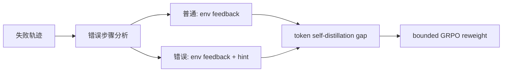
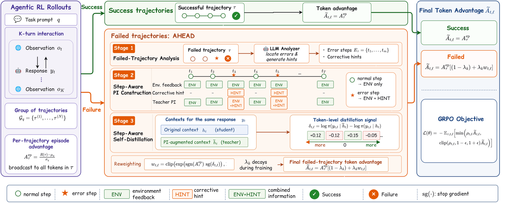

# AHEAD：错误步骤才注入纠错 hint 的 Agent 自蒸馏

> **复现级别：核心机制 mini-suite。** 普通步骤只用环境反馈，错误步骤再追加 corrective hint，并生成稠密信用。

## 论文信息

| 字段 | 内容 |
|---|---|
| 论文链接 | [arXiv 2608.24114](https://arxiv.org/abs/2608.24114) |
| 公司 / 机构 | AWS AI Labs / Purdue University（第一作者署名单位） |
| 首次公开日期 | 2026-08-25（arXiv v1） |
| 原作者代码 | 否：未发现训练代码；作者发布了[模型权重](https://huggingface.co/collections/Bruce-Jin/ahead-alfworld-and-webshop-agents)（核查日期：2026-08-26） |
| 本地 adapter / 方法 | `ahead` |
| 本地复现代码 | [`src/auto_research/agent_research/latest_20260826.py`](https://github.com/daiwk/auto-research/blob/main/src/auto_research/agent_research/latest_20260826.py) |

## 原始论文总结

### 背景与主要改动

轨迹级 GRPO 给所有步骤同一 advantage；统一 privileged information 又浪费在普通步骤上。AHEAD 先分析失败轨迹定位关键错误：所有步骤的 teacher 都看到环境反馈，只有错误步骤额外看到 LLM corrective hint；teacher/student log-prob gap 被有界地注入 GRPO advantage。



<!-- paper-figure:start -->
### 原论文关键图

[](https://arxiv.org/html/2608.24114v1/main.drawio.png)

> **原论文 Figure 2（关键图）**：展示原论文的整体流程、关键阶段及其数据流向。图片来自[原论文](https://arxiv.org/abs/2608.24114)，版权归原作者所有；点击图片可查看来源。
<!-- paper-figure:end -->

### 核心公式

$$
\delta_{t,l}=\log\pi_{old}(y_{t,l}\mid\tilde h_t)-\log\pi_{old}(y_{t,l}\mid h_t),
$$

$$
A_{t,l}=A^{ep}\left(1+\lambda\operatorname{clip}(\delta_{t,l},-\varepsilon,\varepsilon)\right).
$$

### 论文离线与线上效果

7B 相对 GRPO，ALFWorld **+13.3 points**、WebShop success **+11.0 points**；并在搜索 QA 和三种模型规模上验证。无工业线上 A/B。

## 本地复现

PlanBench-mini 120 episodes：24 个 error-step hint、360 个 dense-credit 更新，joint success **1.0000**，平均成本 **0.6160**。指标见 [`metrics/planbench-mini-seed42.json`](metrics/planbench-mini-seed42.json)，批次索引见 [`../../experiments/latest-20260826-seed42.json`](../../experiments/latest-20260826-seed42.json)。

```bash
auto-research agent-eval --method ahead --benchmark planbench-mini --episodes 120 --seed 42
```

## 复现边界

mini-suite 使用确定性错误位置验证 step-aware PI 分流；未运行 LLM analyzer、Qwen、真实 GRPO 或三个原始 benchmark。

## 统一 L2 无 Oracle 结果

在 `toolroute-l2-v1`、60 episodes/seed、seeds 42/43/44 上，AHEAD 的 joint
success 为 **1.0000**、plan step F1 为 **0.9367**、故障恢复率为 **1.0000**。
这里的满分只表示该固定工具环境全部完成；指标见
[`metrics/toolroute-l2-seeds42-44.json`](metrics/toolroute-l2-seeds42-44.json)，统一口径见
[L2 能力评测](../capability-benchmark.md)。
