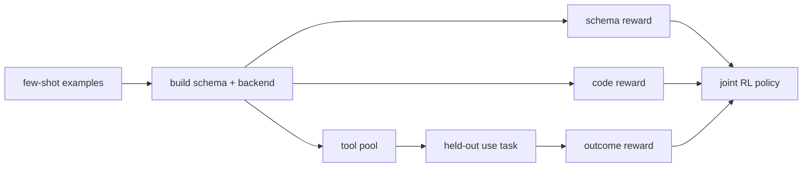
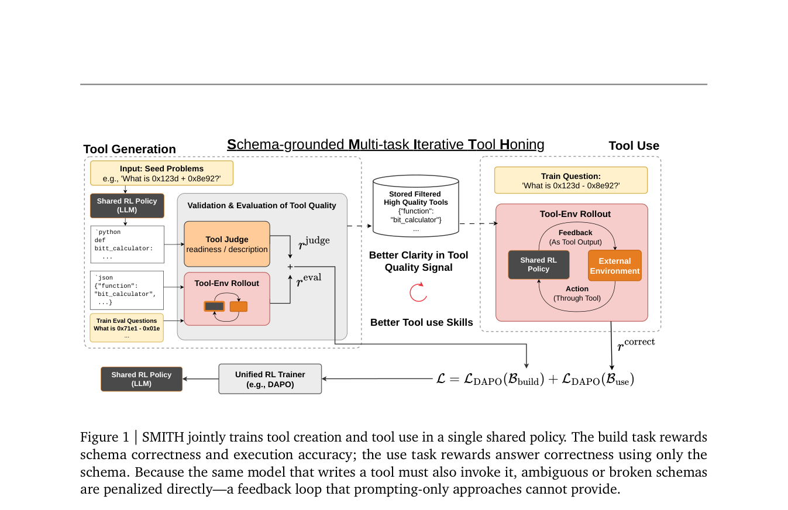

# SMITH：联合训练工具创建与工具使用

> **复现级别：核心机制 mini-suite。** 同一 Agent 交替 build/use，并独立执行 schema、代码和 outcome 三类 verifier。

## 论文信息

| 字段 | 内容 |
|---|---|
| 论文链接 | [arXiv 2608.24571](https://arxiv.org/abs/2608.24571) |
| 公司 / 机构 | Appier AI Research / National Taiwan University（第一作者署名单位） |
| 首次公开日期 | 2026-08-25（arXiv v1） |
| 原作者代码 | 是：[appier-research/smith](https://github.com/appier-research/smith) |
| 本地 adapter / 方法 | `smith` |
| 本地复现代码 | [`src/auto_research/agent_research/latest_20260826.py`](https://github.com/daiwk/auto-research/blob/main/src/auto_research/agent_research/latest_20260826.py) |

## 原始论文总结

### 背景与主要改动

现有工具创建通常在推理时让冻结模型写代码，创建者与使用者没有联合信号。SMITH 在同一 policy 中混合 build task（从样例写 schema/backend）和 use task（在 held-out 问题调用池中工具），分别给 schema 合法性、代码执行和最终答案奖励，并用更难问题鼓励可复用抽象。



<!-- paper-figure:start -->
### 原论文关键图

[](https://arxiv.org/pdf/2608.24571#page=3)

> **原论文 Figure 1（关键图）**：展示原论文方法的总体设计和关键组成。图片来自[原论文](https://arxiv.org/abs/2608.24571)，版权归原作者所有；点击图片可查看来源。
<!-- paper-figure:end -->

### 核心公式

$$
\mathcal J(\theta)=\mathbb E_{\tau\sim\pi_\theta}[r_{schema}(\tau)+r_{code}(\tau)+r_{outcome}(\tau)],
$$

$$
\tau\sim\operatorname{Mix}(\mathcal D_{build},\mathcal D_{use}).
$$

### 论文离线与线上效果

Qwen3-4B 在 held-out Reasoning-Gym 达 **79.8%** macro accuracy；TabMWP-Hard **40.4**、GQA **42.6**，后者相对同骨干推理时基线 **+7.6 points**。无工业线上 A/B。

## 本地复现

PlanBench-mini 120 episodes：生成 12 个工具、复用 108 次，执行 360 个分轴 verifier，joint success **1.0000**、平均成本 **0.4550**。指标见 [`metrics/planbench-mini-seed42.json`](metrics/planbench-mini-seed42.json)，批次索引见 [`../../experiments/latest-20260826-seed42.json`](../../experiments/latest-20260826-seed42.json)。

```bash
auto-research agent-eval --method smith --benchmark planbench-mini --episodes 120 --seed 42
```

## 复现边界

本地工具为结构化 plan，并真实分开 build/use 状态和三轴 verifier；未运行 Qwen3-4B、可执行 Python sandbox、Reasoning-Gym、TabMWP 或 GQA。
