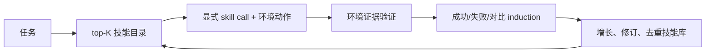
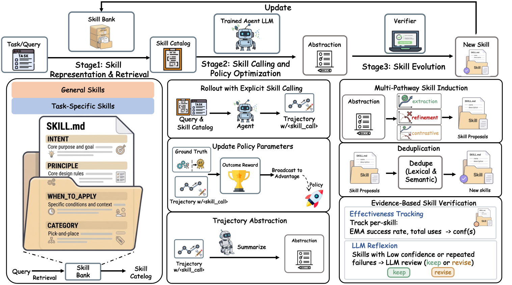

# SkillForge：持续验证而非只追加的技能库

> **复现级别：核心机制 mini-suite。** 技能被显式调用，并根据环境证据更新 posterior 与修订状态。

## 论文信息

| 字段 | 内容 |
|---|---|
| 论文链接 | [arXiv 2608.24747](https://arxiv.org/abs/2608.24747) |
| 公司 / 机构 | AMAP，Alibaba Group（第一作者第一署名单位） |
| 首次公开日期 | 2026-08-25（arXiv v1） |
| 原作者代码 | 否：未发现公开代码（核查日期：2026-08-26） |
| 本地 adapter / 方法 | `skillforge` |
| 本地复现代码 | [`src/auto_research/agent_research/latest_20260826.py`](https://github.com/daiwk/auto-research/blob/main/src/auto_research/agent_research/latest_20260826.py) |

## 原始论文总结

### 背景与主要改动

SkillRL 类方法从轨迹提取技能后只追加，错误和过时技能会永久污染库。SkillForge 让 policy 输出环境动作时显式选择技能，把调用决策纳入 RL；成功、失败和对比轨迹经多路径 induction 生成候选，环境证据再决定激活、修订或去重。



<!-- paper-figure:start -->
### 原论文关键图

[](https://arxiv.org/html/2608.24747v1/skillforge.png)

> **原论文 Figure 2（关键图）**：展示原论文提出的核心架构、主要模块及其连接关系。图片来自[原论文](https://arxiv.org/abs/2608.24747)，版权归原作者所有；点击图片可查看来源。
<!-- paper-figure:end -->

### 核心公式

$$
\max_{\theta,\mathcal B}\;\mathbb E_{d\sim\mathcal D,\tau\sim\pi_\theta(\cdot\mid d,\mathcal B)}[r(\tau)],
$$

$$
\mathcal S_{ret}=\operatorname{TopK}_{s\in\mathcal B}\cos(e_d,e_s),\quad a_t=(a_t^{env},c_t).
$$

### 论文离线与线上效果

无冷启动初始化时，相对 SkillRL 平均提高 **6.3%**；Qwen3-4B 在 ALFWorld/WebShop/AppWorld 分别报告总体 **87.9 / 84.0 / 44.6**。无工业线上 A/B。

## 本地复现

PlanBench-mini 120 episodes：创建 12 个技能、复用 108 次，joint success **1.0000**，平均成本 **0.6200**。指标见 [`metrics/planbench-mini-seed42.json`](metrics/planbench-mini-seed42.json)，批次索引见 [`../../experiments/latest-20260826-seed42.json`](../../experiments/latest-20260826-seed42.json)。

```bash
auto-research agent-eval --method skillforge --benchmark planbench-mini --episodes 120 --seed 42
```

## 复现边界

本地用结构化 plan 作为技能内容，执行调用、验证、posterior 与修订控制流；未运行 LLM teacher induction、ALFWorld/WebShop/AppWorld 或 RL 训练。
