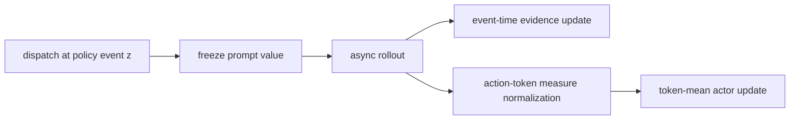
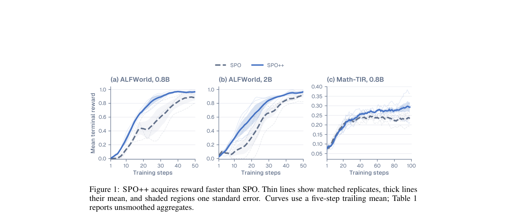

# SPO++：异步 Agent RL 的事件时间与 token measure 对齐

> **复现级别：核心机制 mini-suite。** 每次 dispatch 冻结 prompt value，并按 action-token measure 消费 advantage。

## 论文信息

| 字段 | 内容 |
|---|---|
| 论文链接 | [arXiv 2608.24870](https://arxiv.org/abs/2608.24870) |
| 公司 / 机构 | Renmin University of China（第一作者第一署名单位） |
| 首次公开日期 | 2026-08-25（arXiv v1） |
| 原作者代码 | 否：未发现公开代码（核查日期：2026-08-26） |
| 本地 adapter / 方法 | `spo-plus-plus` |
| 本地复现代码 | [`src/auto_research/agent_research/latest_20260826.py`](https://github.com/daiwk/auto-research/blob/main/src/auto_research/agent_research/latest_20260826.py) |

## 原始论文总结

### 背景与主要改动

SPO 用单 rollout 和持久 prompt value 避免等待 sibling，但 completion 顺序会污染历史，而且 trajectory whitening 与 token-mean actor loss 的测度不一致。SPO++ 按生成策略事件组织证据、dispatch 时冻结 baseline，并用动作 token 数加权标准化 advantage。



<!-- paper-figure:start -->
### 原论文关键图

[](https://arxiv.org/pdf/2608.24870#page=2)

> **原论文 Figure 1（关键图）**：展示原论文方法的总体设计和关键组成。图片来自[原论文](https://arxiv.org/abs/2608.24870)，版权归原作者所有；点击图片可查看来源。
<!-- paper-figure:end -->

### 核心公式

$$
\hat v_x=\frac{\alpha_x}{\alpha_x+\beta_x},\quad A_i=R_i-\hat v_x,
$$

$$
\mu_{tok}=\frac{\sum_i L_iA_i}{\sum_iL_i},\quad \tilde A_i=\frac{A_i-\mu_{tok}}{\sigma_{tok}+10^{-8}}.
$$

### 论文离线与线上效果

相对 SPO，ALFWorld 0.8B/2B reward-curve area 分别 **+19.00 / +15.92 points**，Math-TIR **+2.50 points**。无工业线上 A/B。

## 本地复现

PlanBench-mini 120 episodes：joint success **1.0000**，平均成本 **0.6400**，执行 120 次冻结 value 与 360 个 action-token measure 更新。指标见 [`metrics/planbench-mini-seed42.json`](metrics/planbench-mini-seed42.json)，批次索引见 [`../../experiments/latest-20260826-seed42.json`](../../experiments/latest-20260826-seed42.json)。

```bash
auto-research agent-eval --method spo-plus-plus --benchmark planbench-mini --episodes 120 --seed 42
```

## 复现边界

确定性 mini-suite 验证事件时间状态与测度对齐；未运行异步 Qwen3.5、ALFWorld 或 Math-TIR 训练。
