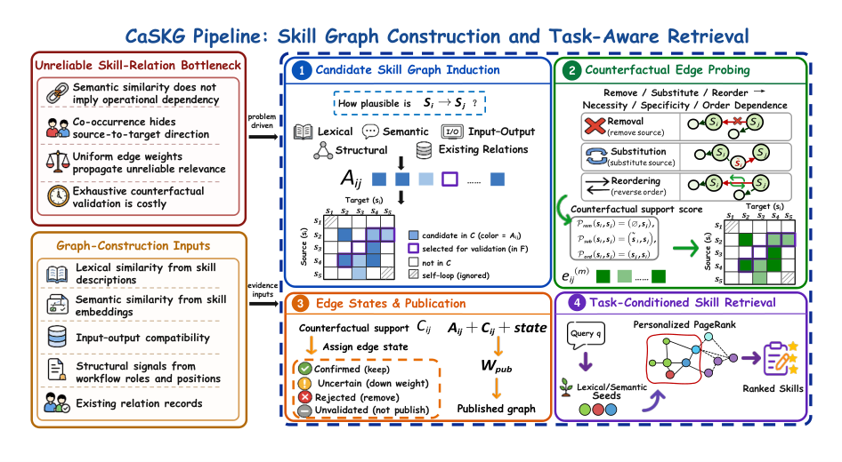

# CaSKG：反事实因果校准的技能图检索

> **复现级别：核心机制 mini-suite。** 真实执行论文特有的控制流/目标；未把确定性任务成功率当作论文 benchmark 复现。

## 论文信息

| 字段 | 内容 |
|---|---|
| 论文链接 | [arXiv 2608.25500](https://arxiv.org/abs/2608.25500) |
| 公司 / 机构 | Jilin University / Ant Group（第一作者第一署名单位） |
| 首次公开日期 | 2026-08-26（arXiv v1） |
| 原作者代码 | 是：[GitHub](https://github.com/ZhiyuanLi218/Caskg) |
| 本地 adapter / 方法 | `caskg` |
| 本地复现代码 | [`src/auto_research/agent_research/latest_20260827.py`](https://github.com/daiwk/auto-research/blob/main/src/auto_research/agent_research/latest_20260827.py) |

## 原始论文总结

### 背景与主要改动

先从语义、词法、I/O 和结构证据建高召回有向图，再以 remove、substitute、reorder 三类文本反事实探针校准边，Bayesian smoothing 后只发布可靠关系。


<!-- paper-figure:start -->
### 原论文关键图

[](https://arxiv.org/html/2608.25500v1/CaSKG_method_overview_final.png)

> **原论文 Figure 1（关键图）**：展示原论文的整体流程、关键阶段及其数据流向。图片来自[原论文](https://arxiv.org/abs/2608.25500)，版权归原作者所有；点击图片可查看来源。
<!-- paper-figure:end -->

### 核心公式

$$
p(e_{ij}|D)=\frac{\alpha_0+s_{ij}}{\alpha_0+\beta_0+n_{ij}},\qquad G^*=\{e:p(e|D)>\tau\}.
$$

### 论文离线与线上效果

相对 Graph-of-Skills，六模型宏平均 ScienceWorld **72.62 → 80.50**、ALFWorld **80.01% → 86.79%**，同时减少环境步数。

## 本地复现

### L2 隔离能力评测（主结果）

CaSKG 从训练 split 学习可复用 skill 路由，在隔离 test 上结合图式记忆与候选验证调用工具。ToolRoute-L2.1 三 seed 的 joint success 为 **0.8000**，plan step F1 为 **0.8327**，平均成本 **5.0116**。

指标见 [`metrics/toolroute-l2-seeds42-44.json`](metrics/toolroute-l2-seeds42-44.json)。下方 PlanBench-mini 只作机制诊断。

> **本地对照口径**：PlanBench-mini 120 episodes，joint success **1.0000**、平均成本 **0.5200**；关注 counterfactual probes、Bayesian edge updates 和图规模。

指标见 [`metrics/caskg-planbench-mini-seed42.json`](metrics/caskg-planbench-mini-seed42.json)。 批次索引见 [`../../experiments/latest-20260827-seed42.json`](../../experiments/latest-20260827-seed42.json)。

```bash
auto-research agent-eval --method caskg --benchmark planbench-mini --episodes 120 --seed 42
```

## 复现边界

本地 mini-suite 用公开、确定性的候选/计划任务隔离机制差异；论文 checkpoint、私有训练数据、外部服务和完整 benchmark 均未声称已复刻。
