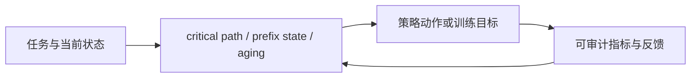
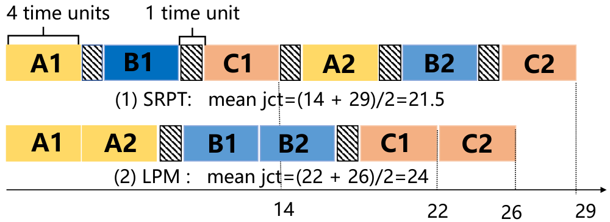

# TOPAS：面向工作流的 Prefix-State 调度

> **复现级别：核心机制 mini-suite。** 真实执行论文特有的控制流/目标；未把确定性任务成功率当作论文 benchmark 复现。

## 论文信息

| 字段 | 内容 |
|---|---|
| 论文链接 | [arXiv 2608.25523](https://arxiv.org/abs/2608.25523) |
| 公司 / 机构 | University of Science and Technology of China（第一作者第一署名单位） |
| 首次公开日期 | 2026-08-26（arXiv v1） |
| 原作者代码 | 否：未发现原作者公开代码（核查日期：2026-08-28） |
| 本地 adapter / 方法 | `topas` |
| 本地复现代码 | [`src/auto_research/agent_research/latest_20260827.py`](https://github.com/daiwk/auto-research/blob/main/src/auto_research/agent_research/latest_20260827.py) |

## 原始论文总结

### 背景与主要改动

在共享 KV-cache 预算下，同时估算工作流最长剩余路径与下游 prefix reuse 收益，并纳入 prefix 移动、抢占和 aging，避免只优化局部命中率或单请求进度。



<!-- paper-figure:start -->
### 原论文关键图

[](https://arxiv.org/html/2608.25523v1/jizhi.png)

> **原论文 Figure 2（关键图）**：展示原论文的整体流程、关键阶段及其数据流向。图片来自[原论文](https://arxiv.org/abs/2608.25523)，版权归原作者所有；点击图片可查看来源。
<!-- paper-figure:end -->

### 核心公式

$$
\Phi(S)=\sum_j w_j\,CP_j(S)-\lambda B_{reuse}(S)+\mu C_{move}(S).
$$

### 论文离线与线上效果

合成工作流 mean/p99 JCT 最多降低 **39.8%/49.4%**；MetaGPT-TL 降低 **22.0%/26.6%**。

## 本地复现

### L2 隔离能力评测（主结果）

TOPAS 在状态化工具环境里先做安全排序与候选压缩，再根据调用反馈恢复。ToolRoute-L2.1 三 seed 的 joint success 为 **0.7556**，plan step F1 为 **0.7887**，平均成本 **4.5571**。

指标见 [`metrics/toolroute-l2-seeds42-44.json`](metrics/toolroute-l2-seeds42-44.json)。下方 PlanBench-mini 只作机制诊断。

> **本地对照口径**：PlanBench-mini 120 episodes，joint success **1.0000**、平均成本 **0.4098**；只模拟 prefix hit、critical-path update 和 aging。

指标见 [`metrics/topas-planbench-mini-seed42.json`](metrics/topas-planbench-mini-seed42.json)。 批次索引见 [`../../experiments/latest-20260827-seed42.json`](../../experiments/latest-20260827-seed42.json)。

```bash
auto-research agent-eval --method topas --benchmark planbench-mini --episodes 120 --seed 42
```

## 复现边界

本地 mini-suite 用公开、确定性的候选/计划任务隔离机制差异；论文 checkpoint、私有训练数据、外部服务和完整 benchmark 均未声称已复刻。
