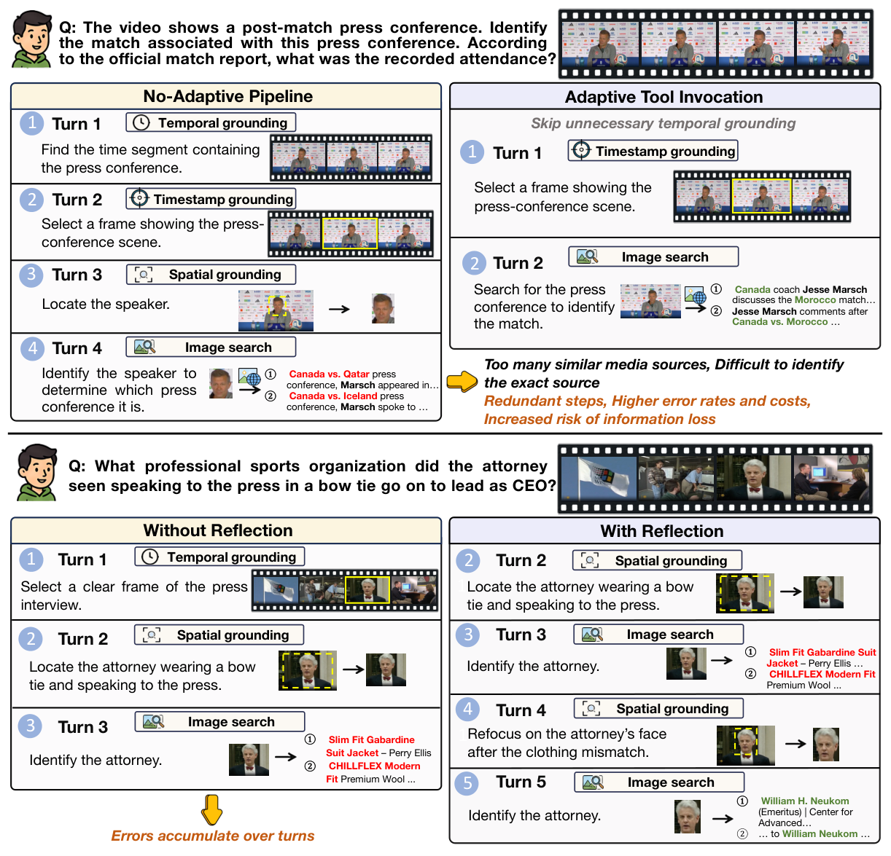

# AdaVDR：自适应工具调用与可靠性反思

> **复现级别：核心机制 mini-suite。** 真实执行论文特有的控制流/目标；未把确定性任务成功率当作论文 benchmark 复现。

## 论文信息

| 字段 | 内容 |
|---|---|
| 论文链接 | [arXiv 2608.25559](https://arxiv.org/abs/2608.25559) |
| 公司 / 机构 | Accio Team，Alibaba Group / Beijing Institute of Technology（第一作者第一署名单位） |
| 首次公开日期 | 2026-08-26（arXiv v1） |
| 原作者代码 | 是：[GitHub](https://github.com/Accio-Lab/AdaVDR) |
| 本地 adapter / 方法 | `adavdr` |
| 本地复现代码 | [`src/auto_research/agent_research/latest_20260827.py`](https://github.com/daiwk/auto-research/blob/main/src/auto_research/agent_research/latest_20260827.py) |

## 原始论文总结

### 背景与主要改动

先以目标模型能力过滤不必要工具调用，只在中间证据不可靠时回退反思；SFT 后用 redundancy-aware reward 做 RL，兼顾视频理解、外部检索和调用成本。


<!-- paper-figure:start -->
### 原论文关键图

[](https://arxiv.org/html/2608.25559v1/teaser.png)

> **原论文 Figure 1（关键图）**：展示原论文方法的总体设计和关键组成。图片来自[原论文](https://arxiv.org/abs/2608.25559)，版权归原作者所有；点击图片可查看来源。
<!-- paper-figure:end -->

### 核心公式

$$
R=R_{answer}-\lambda N_{redundant},\qquad a_t=\begin{cases}tool,&n(x_t)=1\\internal,&n(x_t)=0\end{cases}.
$$

### 论文离线与线上效果

VDR-EE 消融中 adaptive data + reflection 达 **48.0%** 且工具调用 **7.73 → 7.26**；加 RL 后准确率 **51.0%**、调用 **7.84 → 6.80**。

## 本地复现

> **本地对照口径**：PlanBench-mini 120 episodes，joint success **1.0000**、平均成本 **0.4600**；确定性答案不作为主结论，关注 necessity filters、avoided calls 与 reflections。

指标见 [`metrics/adavdr-planbench-mini-seed42.json`](metrics/adavdr-planbench-mini-seed42.json)。 批次索引见 [`../../experiments/latest-20260827-seed42.json`](../../experiments/latest-20260827-seed42.json)。

```bash
auto-research agent-eval --method adavdr --benchmark planbench-mini --episodes 120 --seed 42
```

## 复现边界

本地 mini-suite 用公开、确定性的候选/计划任务隔离机制差异；论文 checkpoint、私有训练数据、外部服务和完整 benchmark 均未声称已复刻。
