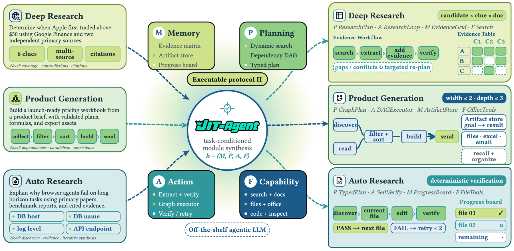

# JIT-Agent：按任务即时生成与自进化 Agent Harness

> **复现级别：核心机制 mini-suite。** 真实执行论文特有的控制流/目标；未把确定性任务成功率当作论文 benchmark 复现。

## 论文信息

| 字段 | 内容 |
|---|---|
| 论文链接 | [arXiv 2608.25593](https://arxiv.org/abs/2608.25593) |
| 公司 / 机构 | LV-NUS Lab（第一作者第一署名单位） |
| 首次公开日期 | 2026-08-26（arXiv v1） |
| 原作者代码 | 是：[GitHub](https://github.com/bingreeky/JIT) |
| 本地 adapter / 方法 | `jit-agent` |
| 本地复现代码 | [`src/auto_research/agent_research/latest_20260827.py`](https://github.com/daiwk/auto-research/blob/main/src/auto_research/agent_research/latest_20260827.py) |

## 原始论文总结

### 背景与主要改动

把 harness 形式化为 memory、planning、action protocol、tools/skills 四个可生成模块；模型按任务生成、失败后修复，并从历史配置 archive 蒸馏可迁移模式。


<!-- paper-figure:start -->
### 原论文关键图

[](https://arxiv.org/html/2608.25593v1/jit_method_overview_final.png)

> **原论文 Figure 2（关键图）**：展示原论文提出的核心架构、主要模块及其连接关系。图片来自[原论文](https://arxiv.org/abs/2608.25593)，版权归原作者所有；点击图片可查看来源。
<!-- paper-figure:end -->

### 核心公式

$$
h^*=\arg\max_h\;\mathbb E[R(\operatorname{Agent}(x;m,h))],\qquad h=(M,P,A,T).
$$

### 论文离线与线上效果

为 DeepSeek-V4-Flash 加 harness 后，在 DeepSearchQA / OdysseyBench 上分别超过 GPT-5.6 **9.1 / 4.3 points**；GLM-5.2 最高提升 **20.2 points**。

## 本地复现

> **本地对照口径**：PlanBench-mini 120 episodes，joint success **0.1500**、平均成本 **0.6180**；低成功率暴露按 axis 归档不足，未伪装成论文效果。

指标见 [`metrics/jit-agent-planbench-mini-seed42.json`](metrics/jit-agent-planbench-mini-seed42.json)。 批次索引见 [`../../experiments/latest-20260827-seed42.json`](../../experiments/latest-20260827-seed42.json)。

```bash
auto-research agent-eval --method jit-agent --benchmark planbench-mini --episodes 120 --seed 42
```

## 复现边界

本地 mini-suite 用公开、确定性的候选/计划任务隔离机制差异；论文 checkpoint、私有训练数据、外部服务和完整 benchmark 均未声称已复刻。
