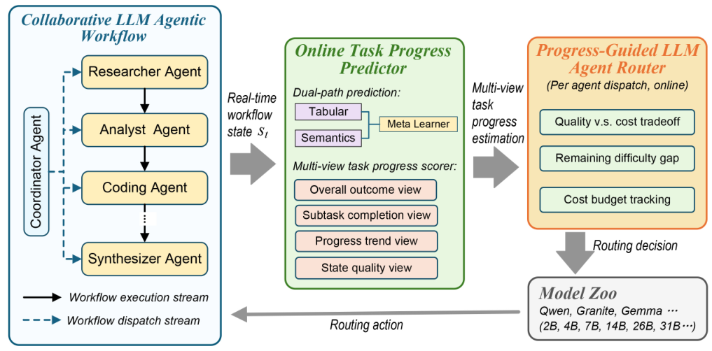

# ProgRouter：在线进展驱动的多 Agent 路由

> **复现级别：核心机制 mini-suite。** 真实执行论文特有的控制流/目标；未把确定性任务成功率当作论文 benchmark 复现。

## 论文信息

| 字段 | 内容 |
|---|---|
| 论文链接 | [arXiv 2608.25992](https://arxiv.org/abs/2608.25992) |
| 公司 / 机构 | Aston University（第一作者第一署名单位） |
| 首次公开日期 | 2026-08-26（arXiv v1） |
| 原作者代码 | 否：未发现原作者公开代码（核查日期：2026-08-28） |
| 本地 adapter / 方法 | `progrouter` |
| 本地复现代码 | [`src/auto_research/agent_research/latest_20260827.py`](https://github.com/daiwk/auto-research/blob/main/src/auto_research/agent_research/latest_20260827.py) |

## 原始论文总结

### 背景与主要改动

用多视角 scorer 衡量子任务完成度、进展趋势和状态质量，再由双路径 predictor 估计候选模型的边际进展，以 meta-gate 在质量、时间和长期成本预算间逐步决策。


<!-- paper-figure:start -->
### 原论文关键图

[](https://arxiv.org/html/2608.25992v1/progrouter_procedures.png)

> **原论文 Figure 2（关键图）**：展示原论文的整体流程、关键阶段及其数据流向。图片来自[原论文](https://arxiv.org/abs/2608.25992)，版权归原作者所有；点击图片可查看来源。
<!-- paper-figure:end -->

### 核心公式

$$
m_t^*=\arg\max_m\frac{\widehat{\Delta p}(m|s_t)}{c(m)}-\lambda_t c(m).
$$

### 论文离线与线上效果

HumanEval+ pass rate **93.0%** 且满足 4800J 预算；MBPP **79.4%**、3376J；ASQA citation precision **92.1%**。

## 本地复现

> **本地对照口径**：PlanBench-mini 120 episodes，joint success **1.0000**、平均成本 **0.3100**；关注 progress predictions、meta-gate 和 budget downgrade。

指标见 [`metrics/progrouter-planbench-mini-seed42.json`](metrics/progrouter-planbench-mini-seed42.json)。 批次索引见 [`../../experiments/latest-20260827-seed42.json`](../../experiments/latest-20260827-seed42.json)。

```bash
auto-research agent-eval --method progrouter --benchmark planbench-mini --episodes 120 --seed 42
```

## 复现边界

本地 mini-suite 用公开、确定性的候选/计划任务隔离机制差异；论文 checkpoint、私有训练数据、外部服务和完整 benchmark 均未声称已复刻。
