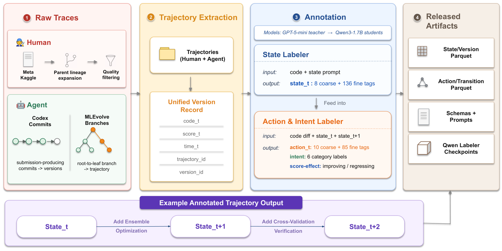

# TraceML：从人类 ML 开发轨迹提炼规划先验

> **复现级别：核心机制 mini-suite。** 真实执行论文特有的控制流/目标；未把确定性任务成功率当作论文 benchmark 复现。

## 论文信息

| 字段 | 内容 |
|---|---|
| 论文链接 | [arXiv 2608.26086](https://arxiv.org/abs/2608.26086) |
| 公司 / 机构 | Carnegie Mellon University（第一作者第一署名单位） |
| 首次公开日期 | 2026-08-26（arXiv v1） |
| 原作者代码 | 是：[TraceML 数据集与 extraction pipeline](https://huggingface.co/datasets/jerryyan/TraceML) |
| 本地 adapter / 方法 | `traceml` |
| 本地复现代码 | [`src/auto_research/agent_research/latest_20260827.py`](https://github.com/daiwk/auto-research/blob/main/src/auto_research/agent_research/latest_20260827.py) |

## 原始论文总结

### 背景与主要改动

统一记录每个代码版本、得分、动作意图、编辑规模和效果，比较 4465 条人类轨迹与 Agent 轨迹；把人类会交替阶段、回开旧方案的规律蒸馏成 planning prior。


<!-- paper-figure:start -->
### 原论文关键图

[](https://arxiv.org/html/2608.26086v1/pipeline.png)

> **原论文 Figure 2（关键图）**：展示原论文的整体流程、关键阶段及其数据流向。图片来自[原论文](https://arxiv.org/abs/2608.26086)，版权归原作者所有；点击图片可查看来源。
<!-- paper-figure:end -->

### 核心公式

$$
\tau=\{(v_t,a_t,i_t,s_t,\Delta s_t)\}_{t=1}^T,\qquad p(a_{t+1}|\tau_{\le t},\text{human prior}).
$$

### 论文离线与线上效果

公开 134 个 Kaggle 比赛的 4465 条人类轨迹，以及 430 条 paired human 和 207 条 agent 轨迹；planning prompt 能提高得分但仍未消除行为差距。

## 本地复现

### L2 隔离能力评测（主结果）

TraceML 策略从训练 split 的失败轨迹写入反思先验，validation/test 只读取先验并通过真实工具反馈推进，不读取隐藏 route 或答案。ToolRoute-L2.1 三 seed 的 joint success 为 **0.7278**，plan step F1 为 **0.7786**，平均成本 **4.7920**。

指标见 [`metrics/toolroute-l2-seeds42-44.json`](metrics/toolroute-l2-seeds42-44.json)。下方 PlanBench-mini 的 1.0 仅表示机制 smoke 饱和。

> **本地对照口径**：PlanBench-mini 120 episodes，joint success **1.0000**、平均成本 **0.4400**；重点指标是四阶段覆盖、versioned edits 和 reopened approaches。

指标见 [`metrics/traceml-planbench-mini-seed42.json`](metrics/traceml-planbench-mini-seed42.json)。 批次索引见 [`../../experiments/latest-20260827-seed42.json`](../../experiments/latest-20260827-seed42.json)。

```bash
auto-research agent-eval --method traceml --benchmark planbench-mini --episodes 120 --seed 42
```

## 复现边界

本地 mini-suite 用公开、确定性的候选/计划任务隔离机制差异；论文 checkpoint、私有训练数据、外部服务和完整 benchmark 均未声称已复刻。
