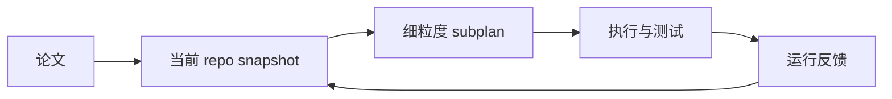
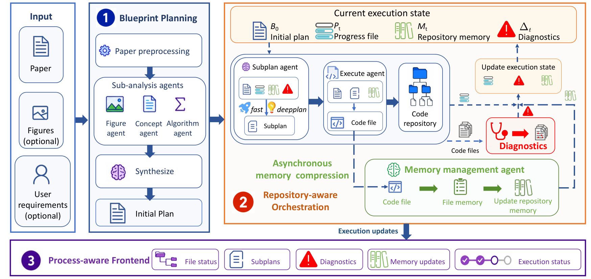

# DeepRepro：随仓库状态演进的论文复现子规划

> **复现级别：核心机制 mini-suite。** 实现 repository snapshot、state-aware subplan 与 runtime-feedback repair。

## 论文信息

| 字段 | 内容 |
|---|---|
| 论文链接 | [arXiv 2608.26557](https://arxiv.org/abs/2608.26557) |
| 公司 / 机构 | 中国科学院计算技术研究所 / 中国科学院大学（第一作者所属机构） |
| 首次公开日期 | 2026-08-27（arXiv v1；CIKM 2026） |
| 原作者代码 | [已公开：DeepRepro](https://github.com/ruyisy/DeepRepro) |
| 本地 adapter / 方法 | `deeprepro` |
| 本地复现代码 | [`src/auto_research/agent_research/latest_20260831.py`](https://github.com/daiwk/auto-research/blob/main/src/auto_research/agent_research/latest_20260831.py) |

## 原始论文总结

### 背景与主要改动

一次性全局计划会在文件、依赖和接口持续变化时失效。DeepRepro 在每个阶段读取当前 repository state 和执行反馈，重写细粒度 subplan，再由 repository-aware orchestration 推进实现。



<!-- paper-figure:start -->
### 原论文关键图

[](https://arxiv.org/html/2608.26557v1/fig_main.png)

> **原论文 Figure 1（关键图）**：展示原论文提出的核心架构、主要模块及其连接关系。图片来自[原论文](https://arxiv.org/abs/2608.26557)，版权归原作者所有；点击图片可查看来源。
<!-- paper-figure:end -->

### 核心公式

$$
p_{t+1}=\operatorname{Subplan}(paper,repo_t,feedback_t).
$$

## 本地复现

planbench-mini、120 episodes：joint success **1.0000**、average cost **0.4300**，并记录 state snapshots、subplan revisions 与 repairs。指标见 [`metrics/planbench-mini-seed42.json`](metrics/planbench-mini-seed42.json)。

## 复现边界

未运行官方 PaperBench Code-Dev，也未把 deterministic plan/answer 满分包装成论文结果；本地验证的是状态驱动重规划路径。

## PaperBench / Code-Dev 产物回放

新增 `public-agent-artifact-eval --method deeprepro`，读取固定 revision 的 PaperBench Code-Dev 或官方 DeepRepro 导出，按 paper/state 顺序回放 plan、executed steps 和 test 结果；比较首轮静态计划与每轮读取 repository state 后重写 subplan 的覆盖率，三种子只用于等预算静态基线采样。

```bash
auto-research public-agent-artifact-eval --method deeprepro \
  --artifact paperbench-code-dev.jsonl --dataset-id paperbench-code-dev \
  --dataset-revision <immutable-sha> --seeds 42,43,44
```

官方仓库当前公开系统代码但未附论文整套 API-budget 轨迹；因此本地支持真实产物 replay，却不会声称已复刻完整 agent/API 成本实验。
