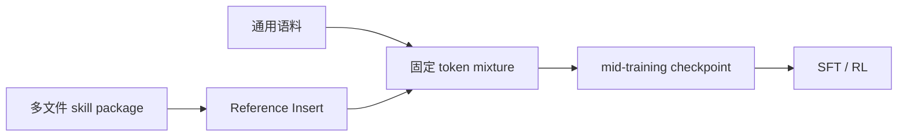
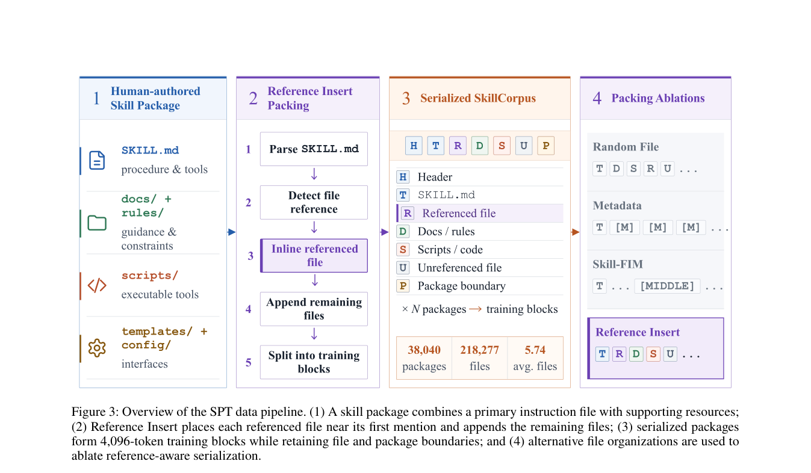

# SPT：把多文件 Skill 当作 Agent 预训练数据

> **复现级别：核心机制 + L2.1 无 oracle 评测。** 实现 skill package、Reference Insert 和跨任务技能先验。

## 论文信息

| 字段 | 内容 |
|---|---|
| 论文链接 | [arXiv 2608.26563](https://arxiv.org/abs/2608.26563) |
| 公司 / 机构 | 北京邮电大学（第一作者第一署名单位），与清华大学合作 |
| 首次公开日期 | 2026-08-27（arXiv v1） |
| 原作者代码 | 否：论文列出 artifact availability，但截至核查日未发现公开仓库（2026-08-29） |
| 本地 adapter / 方法 | `spt` |
| 本地复现代码 | [`src/auto_research/agent_research/latest_20260829.py`](https://github.com/daiwk/auto-research/blob/main/src/auto_research/agent_research/latest_20260829.py) |

## 原始论文总结

### 背景与主要改动

Agent 轨迹昂贵且只描述一次执行；skill package 则显式编码可复用工作流。SPT 在 post-training 前对 SkillCorpus 做 causal LM mid-training，并把被引用文件插到主说明的首次引用附近。

<!-- paper-figure:start -->
### 原论文关键图

> **原论文 Figure 3（关键图）**：展示原论文的整体流程、关键阶段及其数据流向。图片来自[原论文](https://arxiv.org/abs/2608.26563)，版权归原作者所有；点击图片可查看来源。
<!-- paper-figure:end -->

### 核心公式

$$
\mathcal D_\alpha=\alpha\mathcal D_{skill}+(1-\alpha)\mathcal D_{general},\quad \mathcal L=-\sum_t\log p_\theta(x_t\mid x_{<t}).
$$

### 论文离线与线上效果

在三个模型规模、多种 SFT/RL 配方下持续优于无 mid-training、通用语料或轨迹 mid-training，同时基本保持通用能力。

## 本地复现

ToolRoute-L2.1 三 seed：joint success **0.8056**，plan F1 **0.8340**，平均成本 **4.9439**。

指标见 [`metrics/toolroute-l2-seeds42-44.json`](metrics/toolroute-l2-seeds42-44.json)。批次索引见 [`../../experiments/latest-20260829-seed42.json`](../../experiments/latest-20260829-seed42.json)。

## 复现边界

未训练真实 LLM checkpoint；本地验证多文件引用装配和技能先验对无 oracle 工具路由的影响。
