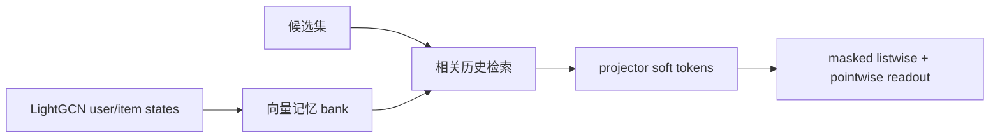
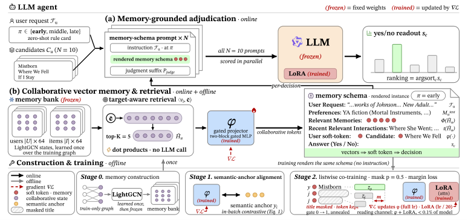

# CoVeMem：可训练的协同向量 Agent 记忆

> **复现级别：核心机制 + L2.1 无 oracle 评测。** 实现候选集检索、向量记忆 bank 和 soft-token read 诊断。

## 论文信息

| 字段 | 内容 |
|---|---|
| 论文链接 | [arXiv 2608.26895](https://arxiv.org/abs/2608.26895) |
| 公司 / 机构 | 深圳技术大学（第一作者第一署名单位） |
| 首次公开日期 | 2026-08-27（arXiv v1） |
| 原作者代码 | 否：未发现原作者公开代码（核查日期：2026-08-29） |
| 本地 adapter / 方法 | `covemem` |
| 本地复现代码 | [`src/auto_research/agent_research/latest_20260829.py`](https://github.com/daiwk/auto-research/blob/main/src/auto_research/agent_research/latest_20260829.py) |

## 原始论文总结

### 背景与主要改动

文本记忆要反复调用 LLM 重写，且丢掉全目录协同几何。CoVeMem 用冻结 LightGCN 状态构造 bank，由当前候选集检索相关历史，投影成 soft token，并通过语义对齐和 masked listwise 联训让 LLM 真正读取记忆。

<!-- paper-figure:start -->
### 原论文关键图

> **原论文 Figure 2（关键图）**：展示原论文方法的总体设计和关键组成。图片来自[原论文](https://arxiv.org/abs/2608.26895)，版权归原作者所有；点击图片可查看来源。
<!-- paper-figure:end -->

### 核心公式

$$
M_C=\operatorname{TopK}_{h\in H_u}\operatorname{sim}(e_h,\bar e_C),\qquad \mathcal L=\mathcal L_{align}+\lambda\mathcal L_{list}.
$$

### 论文离线与线上效果

四个 InstructRec benchmark 的 20 个指标格中 **19 个持平或领先**最强文本协同记忆；静态 profile 后记忆维护新增 LLM 调用为 **0**。

## 本地复现

ToolRoute-L2.1 三 seed：joint success **0.7708**，plan F1 **0.8004**，平均成本 **4.5197**。

指标见 [`metrics/toolroute-l2-seeds42-44.json`](metrics/toolroute-l2-seeds42-44.json)。批次索引见 [`../../experiments/latest-20260829-seed42.json`](../../experiments/latest-20260829-seed42.json)。

## 复现边界

未训练 LightGCN/LoRA checkpoint；本地验证候选条件向量读取和零文本重写控制流。
