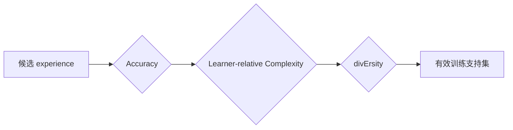
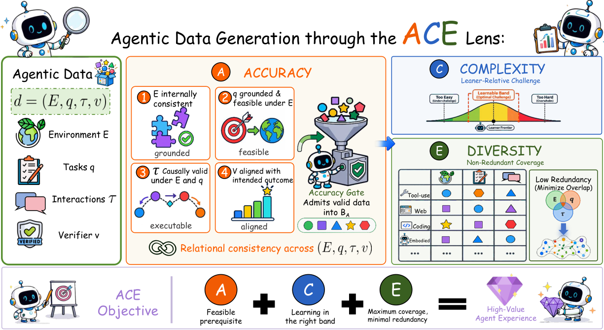

# ACE Lens：Agent 数据的准确性、复杂度与多样性

> **复现级别：框架可执行化 mini-suite。** 论文是综述/统一框架；本地把三道约束实现为数据准入门。

## 论文信息

| 字段 | 内容 |
|---|---|
| 论文链接 | [arXiv 2608.27260](https://arxiv.org/abs/2608.27260) |
| 公司 / 机构 | 华为技术有限公司（第一作者第一署名单位） |
| 首次公开日期 | 2026-08-27（arXiv v1；论文标注 2026-08-28） |
| 原作者代码 | 否：综述论文，未发现原作者公开代码（核查日期：2026-08-31） |
| 本地 adapter / 方法 | `ace-data` |
| 本地复现代码 | [`src/auto_research/agent_research/latest_20260831.py`](https://github.com/daiwk/auto-research/blob/main/src/auto_research/agent_research/latest_20260831.py) |

## 原始论文总结

### 背景与主要改动

论文把 Agent 数据统一表示为 $(E,q,\tau,v)$：环境、任务、交互轨迹与可选 verifier。Accuracy 先限定可信支持集，Complexity 相对指定学习者校准难度，Diversity 再控制环境、任务和行为覆盖。

<!-- paper-figure:start -->
### 原论文关键图

> **原论文 Figure 1（关键图）**：展示原论文方法的总体设计和关键组成。图片来自[原论文](https://arxiv.org/abs/2608.27260)，版权归原作者所有；点击图片可查看来源。
<!-- paper-figure:end -->

### 核心公式

$$
D=\{(E,q,\tau,v):A(E,q,\tau,v)=1,\ C\in\mathcal B_L,\ \operatorname{Div}(D)\ge\delta\}.
$$

## 本地复现

planbench-mini、120 episodes：joint success **1.0000**、average cost **0.3700**，另记录 accuracy gates、complexity calibration 和 diversity accept/reject。指标见 [`metrics/planbench-mini-seed42.json`](metrics/planbench-mini-seed42.json)。

## 复现边界

这是框架的可执行准入合同，不声称复刻某个训练模型或公开 benchmark SOTA。
