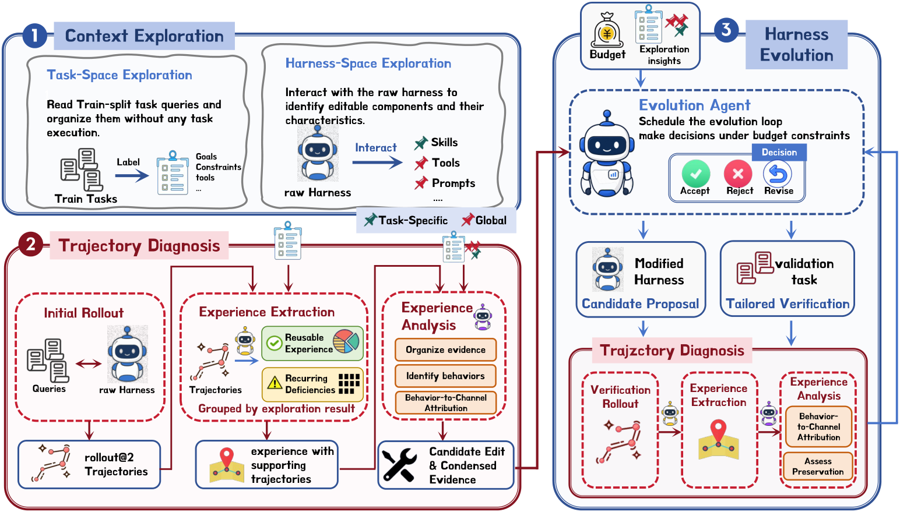

# HarnessLens：行为相关的低预算 Harness 验证

> **复现级别：核心机制 + L2.1 无 oracle 评测。** 实现行为任务选择、配对验证与可归因证据门。

## 论文信息

| 字段 | 内容 |
|---|---|
| 论文链接 | [arXiv 2608.27311](https://arxiv.org/abs/2608.27311) |
| 公司 / 机构 | 复旦大学数据科学学院（第一作者第一署名单位） |
| 首次公开日期 | 2026-08-27（arXiv v1） |
| 原作者代码 | 是：[jhxu5214/HarnessLens](https://github.com/jhxu5214/HarnessLens) |
| 本地 adapter / 方法 | `harnesslens` |
| 本地复现代码 | [`src/auto_research/agent_research/latest_20260829.py`](https://github.com/daiwk/auto-research/blob/main/src/auto_research/agent_research/latest_20260829.py) |

## 原始论文总结

### 背景与主要改动

固定验证集浪费 rollout 且会用平均分掩盖局部回退。HarnessLens 从执行轨迹提出修改，只在受影响行为对应的任务上成对验证，并要求证据能归因到候选修改。

<!-- paper-figure:start -->
### 原论文关键图

> **原论文 Figure 2（关键图）**：展示原论文方法的总体设计和关键组成。图片来自[原论文](https://arxiv.org/abs/2608.27311)，版权归原作者所有；点击图片可查看来源。
<!-- paper-figure:end -->

### 核心公式

$$
\Delta_b=R_b(h')-R_b(h),\quad \mathrm{accept}(h')=\mathbf1[\Delta_b>0\land A_b=1].
$$

### 论文离线与线上效果

三个 harness、四个 benchmark 上 held-out 平均提升 **7.6%–13.6%**，同时减少验证预算。

## 本地复现

ToolRoute-L2.1 三 seed：joint success **0.8194**，plan F1 **0.8372**，平均成本 **5.0419**。

指标见 [`metrics/toolroute-l2-seeds42-44.json`](metrics/toolroute-l2-seeds42-44.json)。批次索引见 [`../../experiments/latest-20260829-seed42.json`](../../experiments/latest-20260829-seed42.json)。

## 复现边界

未运行论文四个完整 benchmark；本地执行冻结测试集和无 answer/guide 接口的真实工具反馈协议。
