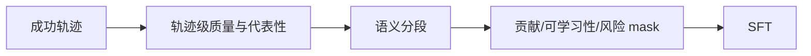
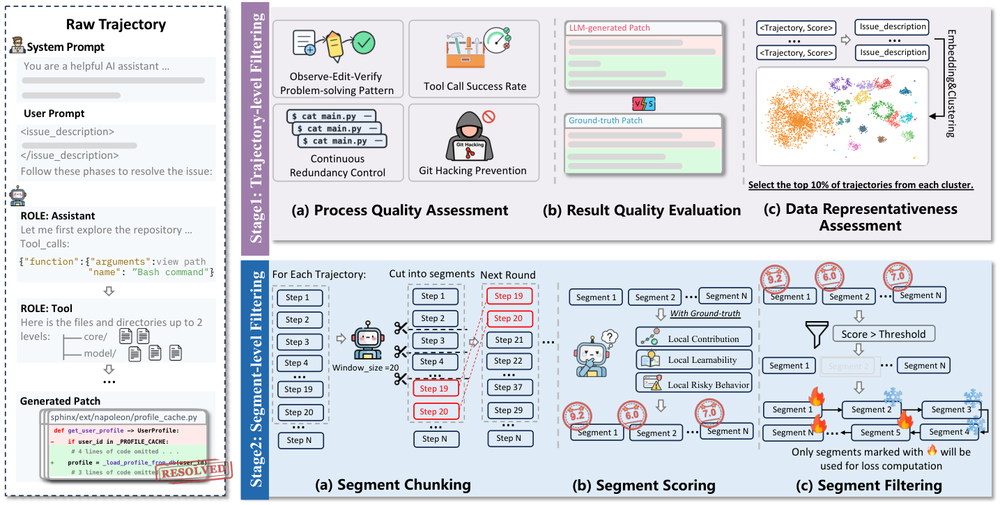

# SWE-Prime：少而精的软件 Agent 轨迹训练

> **复现级别：核心机制 + L2.1 无 oracle 评测。** 实现轨迹筛选、语义段筛选和 loss mask。

## 论文信息

| 字段 | 内容 |
|---|---|
| 论文链接 | [arXiv 2608.27449](https://arxiv.org/abs/2608.27449) |
| 公司 / 机构 | 中山大学（第一作者第一署名单位），与华为云、重庆大学合作 |
| 首次公开日期 | 2026-08-27（arXiv v1） |
| 原作者代码 | 否：未发现原作者公开代码（核查日期：2026-08-29） |
| 本地 adapter / 方法 | `swe-prime` |
| 本地复现代码 | [`src/auto_research/agent_research/latest_20260829.py`](https://github.com/daiwk/auto-research/blob/main/src/auto_research/agent_research/latest_20260829.py) |

## 原始论文总结

### 背景与主要改动

成功轨迹仍可能冗余、危险或不可学习。SWE-Prime 先按过程、结果和代表性选轨迹，再按贡献、可学习性和风险选语义段；上下文完整保留，但只对选中段计算 SFT loss。

<!-- paper-figure:start -->
### 原论文关键图

> **原论文 Figure 2（关键图）**：展示原论文提出的核心架构、主要模块及其连接关系。图片来自[原论文](https://arxiv.org/abs/2608.27449)，版权归原作者所有；点击图片可查看来源。
<!-- paper-figure:end -->

### 核心公式

$$
\mathcal L=-\sum_t m_t\log p_\theta(y_t\mid y_{<t},x),\quad m_t\in\{0,1\}.
$$

### 论文离线与线上效果

只使用 **10%** 轨迹，在 SWE-Bench Pro / Verified 上相对全量成功轨迹最高提升 **12.2% / 24.2%**。

## 本地复现

ToolRoute-L2.1 三 seed：joint success **0.7708**，plan F1 **0.8004**，平均成本 **4.5497**。

指标见 [`metrics/toolroute-l2-seeds42-44.json`](metrics/toolroute-l2-seeds42-44.json)。批次索引见 [`../../experiments/latest-20260829-seed42.json`](../../experiments/latest-20260829-seed42.json)。

## 复现边界

未训练代码 LLM，也未运行官方 SWE-Bench；本地只比较相同 observation/tool 接口下的筛选策略。
