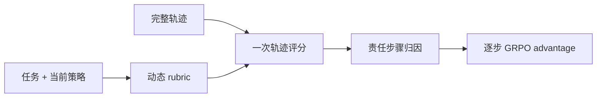
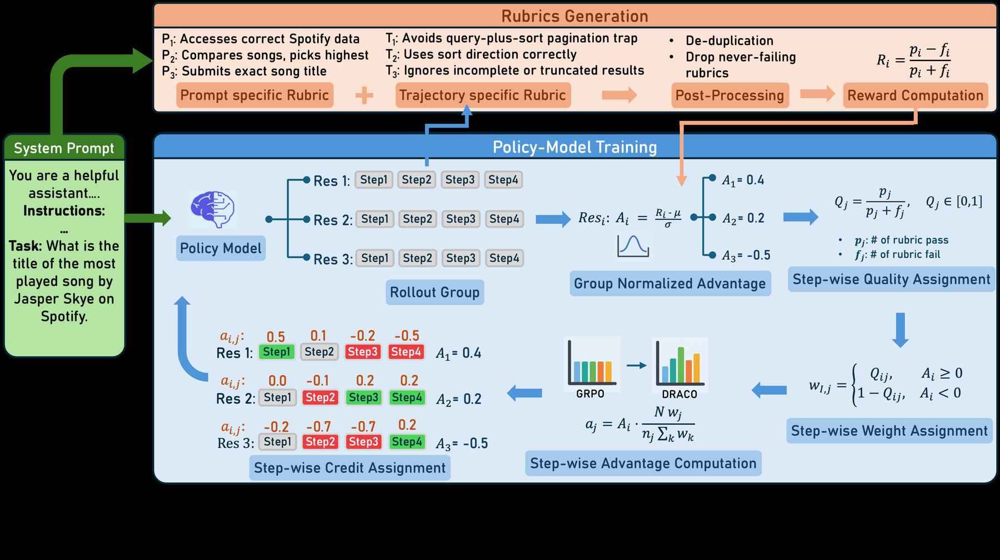

# DRACO：动态 Rubric 的长程 Agent 步骤信用分配

> **复现级别：核心机制 mini-suite。** 实现动态 rubric、责任步骤归因和轨迹分数重分配。

## 论文信息

| 字段 | 内容 |
|---|---|
| 论文链接 | [arXiv 2609.04094](https://arxiv.org/abs/2609.04094) |
| 公司 / 机构 | Carnegie Mellon University（第一作者第一署名单位；合作方 IBM Research） |
| 首次公开日期 | 2026-09-03（arXiv v1） |
| 原作者代码 | 是：[IBM/draco](https://github.com/IBM/draco) |
| 本地 adapter / 方法 | `draco` |
| 本地复现代码 | [`src/auto_research/agent_research/latest_20260905.py`](https://github.com/daiwk/auto-research/blob/main/src/auto_research/agent_research/latest_20260905.py) |

## 原始论文总结

### 背景与主要改动

长程 Agent 往往没有程序化 verifier，单一轨迹总分又无法告诉策略是哪一步有效。DRACO 随策略能力变化动态生成多维 rubric，只在轨迹结束时评分一次，再依据 rubric 的步骤标注闭式分配 advantage，不额外训练 attribution model。

<!-- paper-figure:start -->
### 原论文关键图

> **原论文 Figure 1（关键图）**：展示原论文方法的总体设计和关键组成。图片来自[原论文](https://arxiv.org/abs/2609.04094)，版权归原作者所有；点击图片可查看来源。
<!-- paper-figure:end -->

### 核心公式

若 rubric j 的轨迹分数为 $r_j$、责任步骤集合为 $S_j$，本地保持论文的核心约束：$A_t=\sum_{j:t\in S_j}w_{jt}r_j$，并对长度和 reward 尺度做归一化。

### 论文离线与线上效果

论文在 AppWorld 相对 base 提升 15.9 分，相对稀疏真实 reward GRPO 提升 5.3 分；Tau-Bench 域外也提升 5.3 分。

## 本地复现

统一 Agent mini-suite 的 seeds 42/43/44 产物记录动态 rubric 数、被归因步骤数、信用重分配次数以及成功/成本，见 [`metrics/mini-suite-seeds42-44.json`](metrics/mini-suite-seeds42-44.json)。

## 复现边界

本地使用确定性任务 fixture，不声称复刻 AppWorld/Tau-Bench 大模型训练或 frontier judge；没有 CUDA 广告路径。
