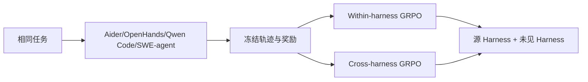
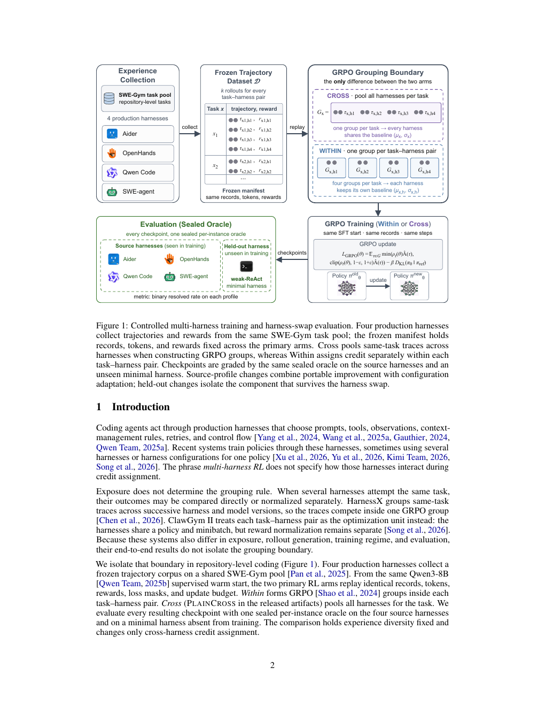

# Multi-Harness RL：训练收益究竟来自策略还是执行 Harness

> **复现级别：分组与可迁移性审计 mini-suite。** 显式区分 within-harness、cross-harness advantage 和 held-out harness。

## 论文信息

| 字段 | 内容 |
|---|---|
| 论文链接 | [arXiv 2609.04518](https://arxiv.org/abs/2609.04518) |
| 公司/机构 | New York University（第一作者第一署名单位） |
| 首次公开日期 | 2026-09-03（arXiv v1） |
| 原文开源代码 | 否：论文称结果 artifact 已发布，但未找到可核验的公共仓库链接（核查日期：2026-09-07） |
| Adapter / 方法 | `multi-harness-rl` |
| 本地复现代码 | [`src/auto_research/agent_research/latest_20260907.py`](https://github.com/daiwk/auto-research/blob/main/src/auto_research/agent_research/latest_20260907.py) |

## 原始论文总结

### 背景与主要改动

多 Harness RL 同时改变了执行环境多样性和 GRPO 的分组边界，难以判断增益来源。论文冻结相同 task-harness 轨迹，只比较组内和跨 harness advantage，并用训练中未见的最小 harness 审计能力是否真正迁移。

<!-- paper-figure:start -->
### 原论文关键图

> **原论文 Figure 1（关键图）**：展示冻结经验、两种信用分组与 sealed held-out 评测。图片来自[原论文](https://arxiv.org/abs/2609.04518)，版权归原作者所有。
<!-- paper-figure:end -->

### 核心公式

Within 在每个 $(task,harness)$ 内标准化 reward；Cross 在同一 task 的不同 harness 间标准化。真正的迁移量以未见 harness 上 $\Delta=R_{cross}-R_{within}$ 及置信区间报告。

### 论文离线与线上效果

24,000 次 sealed SWE-bench Verified 评估中，评测 harness 令平均解决率从 2.14% 变化到 9.27%，而训练配方影响小得多；held-out 上 Cross-Within 仅 +0.25pp，95% CI 为 [-0.48,+1.02]。

## 本地复现

seeds 42/43/44 的 within/cross 分组、held-out 审计、rolewise update 与成本见 [`metrics/mini-suite-seeds42-44.json`](metrics/mini-suite-seeds42-44.json)。

> **本地对照口径**：本地验证实验协议和计数器，不伪装成 SWE-bench Verified、Aider 或 OpenHands 已接入。

## 复现边界

真实 coding harness、Qwen3-8B RL 和 sealed oracle 均未在本地复刻；该实现用于防止未来 Evolve 实验把 harness 差异误报为模型能力。
