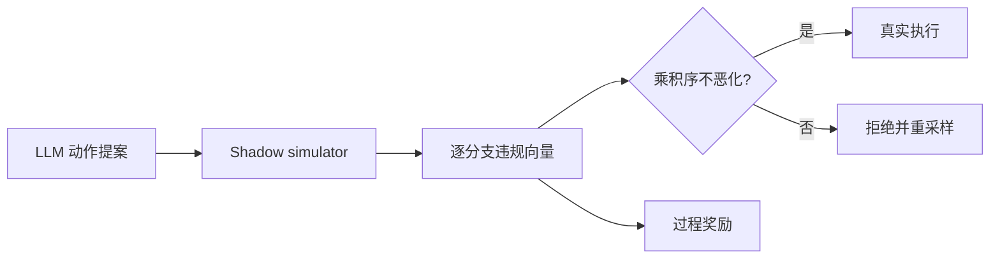
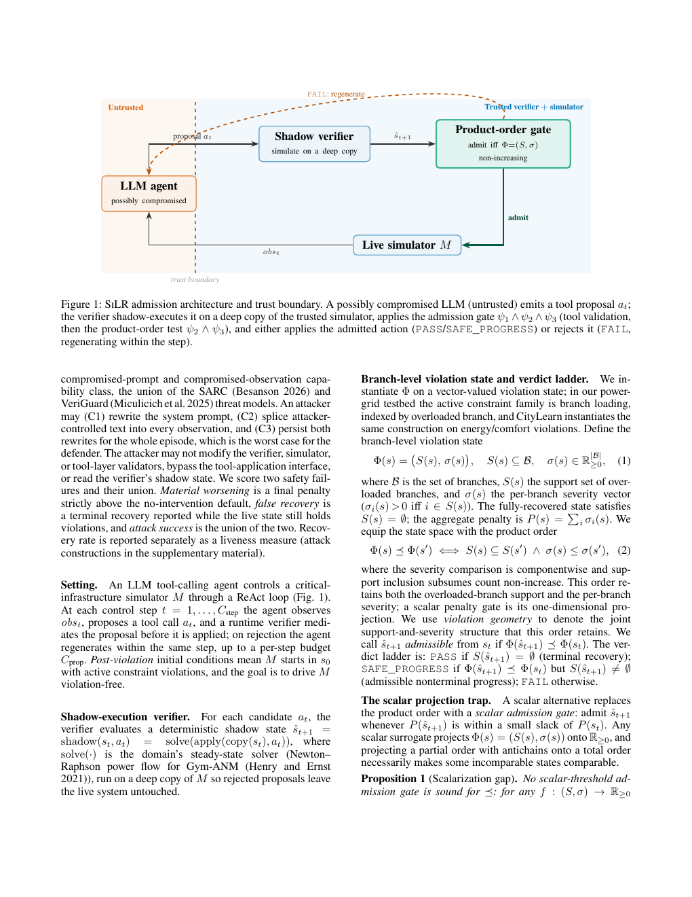

# SiLR：保持约束结构的 Agent 准入与过程奖励

> **复现级别：结构化 verifier mini-suite。** 实现 shadow execution、逐分支乘积序准入和同源过程奖励。

## 论文信息

| 字段 | 内容 |
|---|---|
| 论文链接 | [arXiv 2609.04629](https://arxiv.org/abs/2609.04629) |
| 公司/机构 | Institute of Science Tokyo（第一作者第一署名单位） |
| 首次公开日期 | 2026-09-03（arXiv v1） |
| 原文开源代码 | 否：未找到公开代码仓库（核查日期：2026-09-07） |
| Adapter / 方法 | `silr` |
| 本地复现代码 | [`src/auto_research/agent_research/latest_20260907.py`](https://github.com/daiwk/auto-research/blob/main/src/auto_research/agent_research/latest_20260907.py) |

## 原始论文总结

### 背景与主要改动

系统已经违规时，安全门不能简单拒绝所有仍不安全的动作，而要允许逐步恢复。SiLR 先 shadow-execute 提案，再比较每个受约束分支的严重度；只有在乘积序上不恶化的动作可进入真实环境，同一结构信号还能作为 GRPO 过程奖励。

<!-- paper-figure:start -->
### 原论文关键图

> **原论文 Figure 1（关键图）**：展示 LLM、影子模拟器和结构准入边界。图片来自[原论文](https://arxiv.org/abs/2609.04629)，版权归原作者所有。
<!-- paper-figure:end -->

### 核心公式

令违规状态为向量 $v(a)$，动作 $a'$ 仅在 $v_j(a')\le v_j(a)$ 对全部分支 $j$ 成立时获准；任何单一标量投影都可能掩盖某个分支的恶化。

### 论文离线与线上效果

Gym-ANM 多动作场景中 SiLR 恢复 21/21，terminal admission 为 0/21、最佳标量门为 9/21；完整乘积序在 42,410 个不安全动作上错误准入为 0，并在过程奖励实验中达到 0.844 对未训练 0.778。

## 本地复现

seeds 42/43/44 的 shadow 次数、结构准入/拒绝、verifier 调用和成功成本见 [`metrics/mini-suite-seeds42-44.json`](metrics/mini-suite-seeds42-44.json)。

> **本地对照口径**：本地使用离散分支严重度 fixture 验证偏序逻辑，不模拟电网或 CityLearn 物理动力学。

## 复现边界

本实现不替代真实系统 simulator；没有确定性、覆盖充分的 verifier 时不能据此宣称安全。
