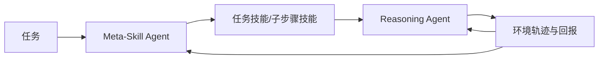
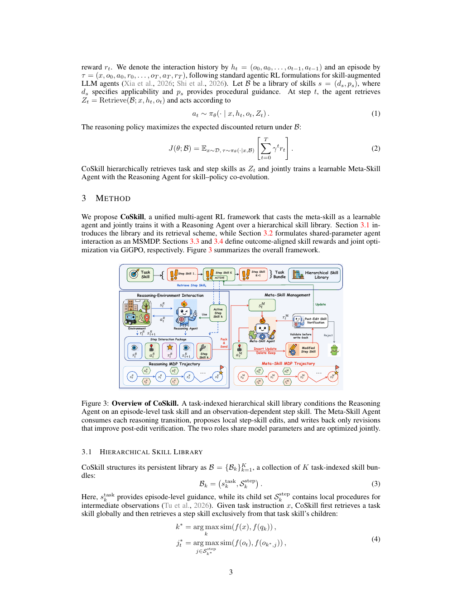

# CoSkill：推理 Agent 与元技能 Agent 的联合强化学习

> **复现级别：公开 checkpoint 训练实验。** Qwen3-4B 的同一末层参数同时接收推理和技能编辑梯度，动作由真实模型生成并交给 ToolRoute 环境执行；不是原论文 ALFWorld/WebShop、VERL 或 7B 训练复现。

## 论文信息

| 字段 | 内容 |
|---|---|
| 论文链接 | [arXiv 2609.04865](https://arxiv.org/abs/2609.04865) |
| 公司/机构 | Institute of Automation, Chinese Academy of Sciences（第一作者第一署名单位） |
| 首次公开日期 | 2026-09-04（arXiv v1） |
| 原文开源代码 | 是：[jinyuan-cookie/CoSkill](https://github.com/jinyuan-cookie/CoSkill) |
| Adapter / 方法 | `coskill` |
| 本地复现代码 | [`coskill_rollout.py`](https://github.com/daiwk/auto-research/blob/main/src/auto_research/agent_research/coskill_rollout.py)、[`coskill_checkpoint.py`](https://github.com/daiwk/auto-research/blob/main/src/auto_research/agent_research/coskill_checkpoint.py) |

## 原始论文总结

### 背景与主要改动

以往技能库要么与策略优化分离，要么把元技能写成固定工作流。CoSkill 让 Reasoning Agent 使用任务技能及其子步骤技能，让可学习 Meta-Skill Agent 根据执行回报改写技能；二者共享 backbone 并端到端联合训练。

<!-- paper-figure:start -->
### 原论文关键图

> **原论文 Figure 3（关键图）**：展示推理与技能优化两类策略的联合循环。图片来自[原论文](https://arxiv.org/abs/2609.04865)，版权归原作者所有。
<!-- paper-figure:end -->

### 核心公式

共享团队回报下，$J(\theta_R,\theta_M)=\mathbb E_{\tau\sim\pi_R,\pi_M}[R(\tau)]$；训练交替更新推理策略与元技能策略，使技能选择和技能内容共同适配任务分布。

### 论文离线与线上效果

论文在 ALFWorld、WebShop 的成功率为 98.4% 和 90.6%，分别较对比方法提升 3.5 和 6.2 个百分点，并报告更好的样本与墙钟效率。

## 本地复现

### 2026-09-08 保真度更正

旧版直接返回评测标签，原准确率/计划成功率作废。入口现在只接收 task_id、intent、context；读取 answer、plan 或隐藏 required_tools 会在回归测试中报错。新 legacy 结果仅是公开文本格式解析诊断，即使为 1 也不是 Agent 能力；cost 是读取记录数，不是实际工具费用。

真实路径先让共享 checkpoint 生成工具 JSON，执行环境只返回本次转移的公开反馈；Meta-Skill 在整组 baseline 完成后才应用私有编辑，再以重置后的验证轨迹计算相对回报。不同角色分别归一化信用，但更新同一个可训练 block。`toolroute-checkpoint` 已接入统一 evolve，仅进化真实执行的学习率与 rollout group；legacy mini-suite 和仅注册名称的论文算子不能晋级。A100 上还从 CLI 完整执行了一轮 baseline → CoSkill 候选 → validation → 选优 → final test → 报告，并验证运行目录内 checkpoint 可恢复；该小规模 smoke 的候选参数变化为 828.94，但 validation 与基线同为 1.0，因此基线保留为冠军。

A100 的 seeds 42/43/44 均出现实际参数变化和双角色非零梯度，但验证成功率没有稳定提升：分别为 0.9167 → 0.8333、0.8333 → 0.8333、0.9167 → 0.9167；对应 test 为 0.9167、0.7500、0.8333。所有候选技能编辑在重置验证后均未取得正增益，因此没有晋级。完整脱敏结果见 [`metrics/qwen3-toolroute-a100-seeds42-44.json`](metrics/qwen3-toolroute-a100-seeds42-44.json)，GPU 执行收据见 [`coskill-checkpoint-a100-20260910.json`](../../gpu-validations/coskill-checkpoint-a100-20260910.json)。这些负结果证明训练和拒绝路径实际执行，不证明 CoSkill 优于冻结 checkpoint，也不复刻论文原基准。

seeds 42/43/44 的任务/步骤技能检索、技能创建与复用、协同交替次数和成本见 [`metrics/mini-suite-seeds42-44.json`](metrics/mini-suite-seeds42-44.json)。

> **本地对照口径**：legacy mini-suite 仅暂存公开观察中的程序，不把存储动作记作策略训练。独立回归测试验证编辑隔离、拒绝无收益编辑和双角色梯度；不复刻论文 benchmark 分数。

## 复现边界

本地使用 Qwen3-4B 最后一层和自建 ToolRoute，不含论文的离线技能初始化、SentenceT5 子技能检索、ALFWorld/WebShop 或原仓库训练规模，因此不得与论文分数横向比较。
