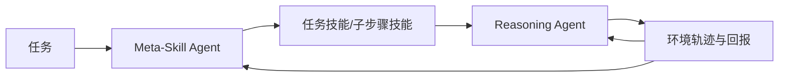

# CoSkill：推理 Agent 与元技能 Agent 的联合强化学习

> **复现级别：层级技能协同 mini-suite。** 实现任务技能、子步骤技能与交替协同更新的可观测状态。

## 论文信息

| 字段 | 内容 |
|---|---|
| 论文链接 | [arXiv 2609.04865](https://arxiv.org/abs/2609.04865) |
| 公司/机构 | Institute of Automation, Chinese Academy of Sciences（第一作者第一署名单位） |
| 首次公开日期 | 2026-09-04（arXiv v1） |
| 原文开源代码 | 是：[jinyuan-cookie/CoSkill](https://github.com/jinyuan-cookie/CoSkill) |
| Adapter / 方法 | `coskill` |
| 本地复现代码 | [`src/auto_research/agent_research/latest_20260907.py`](https://github.com/daiwk/auto-research/blob/main/src/auto_research/agent_research/latest_20260907.py) |

## 原始论文总结

### 背景与主要改动

以往技能库要么与策略优化分离，要么把元技能写成固定工作流。CoSkill 让 Reasoning Agent 使用任务技能及其子步骤技能，让可学习 Meta-Skill Agent 根据执行回报改写技能；二者共享 backbone 并端到端联合训练。

<!-- paper-figure:start -->
### 原论文关键图

> **原论文 Figure 3（关键图）**：展示推理与技能优化两类策略的联合循环。图片来自[原论文](https://arxiv.org/abs/2609.04865)，版权归原作者所有。
<!-- paper-figure:end -->

### 核心公式

共享团队回报下，$J(\theta_R,\theta_M)=\mathbb E_{\tau\sim\pi_R,\pi_M}[R(\tau)]$；训练交替更新推理策略与元技能策略，使技能选择和技能内容共同适配任务分布。

### 论文离线与线上效果

论文在 ALFWorld、WebShop 的成功率为 98.4% 和 90.6%，分别较对比方法提升 3.5 和 6.2 个百分点，并报告更好的样本与墙钟效率。

## 本地复现

seeds 42/43/44 的任务/步骤技能检索、技能创建与复用、协同交替次数和成本见 [`metrics/mini-suite-seeds42-44.json`](metrics/mini-suite-seeds42-44.json)。

> **本地对照口径**：本地验证跨 episode 的层级技能状态确实演化，不复刻 LLM 强化学习或论文 benchmark 分数。

## 复现边界

本地为确定性控制机制，不包含共享大模型 backbone、VERL rollout 或原仓库训练规模。
