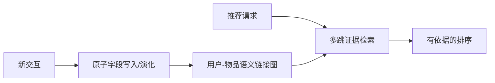

# AtomRec：面向 Agent 推荐的原子协同记忆

> **复现级别：CPU 原子记忆图算子。** 实际维护节点、链接、版本与多跳路径；默认词法相似度不是论文中的 LLM 语义链接/编辑器。

## 论文信息

| 字段 | 内容 |
|---|---|
| 论文链接 | [arXiv 2609.04882](https://arxiv.org/abs/2609.04882) |
| 公司/机构 | Xi'an Jiaotong-Liverpool University（第一作者第一署名单位；合作方 Xiaohongshu） |
| 首次公开日期 | 2026-09-04（arXiv v1） |
| 原文开源代码 | 否：未找到公开代码仓库（核查日期：2026-09-07） |
| Adapter / 方法 | `atomrec` |
| 本地复现代码 | [`src/auto_research/agent_research/latest_20260907.py`](https://github.com/daiwk/auto-research/blob/main/src/auto_research/agent_research/latest_20260907.py) |

## 原始论文总结

### 背景与主要改动

粗粒度用户摘要会在重写时覆盖旧偏好，单一协同边又难以解释推荐。AtomRec 将用户和物品历史拆成可独立演化的原子字段，建立语义协同链接，并以多跳路径取回“为什么推荐”的证据。

<!-- paper-figure:start -->
### 原论文关键图

> **原论文 Figure 2（关键图）**：展示原子记忆、语义链接与证据路径构建。图片来自[原论文](https://arxiv.org/abs/2609.04882)，版权归原作者所有。
<!-- paper-figure:end -->

### 核心公式

查询 $q$ 的路径证据分数写为 $s(P|q)=\sum_{(u,v)\in P}\operatorname{sim}(q,m_v)+\lambda w_{uv}$；更新只改写被命中的原子字段，而非覆盖完整画像。

### 论文离线与线上效果

论文在四个公开数据集上相对 agentic 与 memory-augmented 基线取得约 8.5% 的跨指标平均相对提升。

## 本地复现

### 2026-09-08 保真度更正

旧版直接返回评测标签，原准确率/计划成功率作废。入口现在只接收 task_id、intent、context；读取 answer、plan 或隐藏 required_tools 会在回归测试中报错。新 legacy 结果仅是公开文本格式解析诊断，即使为 1 也不是 Agent 能力；cost 是读取记录数，不是实际工具费用。

实际算子位置：[`sep7_mechanisms.py`](https://github.com/daiwk/auto-research/blob/main/src/auto_research/agent_research/sep7_mechanisms.py)。运行 `python -m pytest tests/test_sep7_fidelity.py -q` 检查记忆路径、私有技能编辑、拒绝后状态不变、组间信用差异与反向传播。独立算子不能被当作已集成完整 LLM、真实工具环境或端到端 evolve 的证明。

统一 Agent mini-suite 的 seeds 42/43/44 记录原子写入、多跳检索、回答/计划成功率与成本，见 [`metrics/mini-suite-seeds42-44.json`](metrics/mini-suite-seeds42-44.json)。

> **本地对照口径**：本地任务检验记忆状态和证据路径，不复刻论文四个推荐数据集的 LLM 排序结果。

## 复现边界

未获得原作者代码、提示词和完整实验配置；本地不声称复刻 Xiaohongshu 系统或线上实验。
