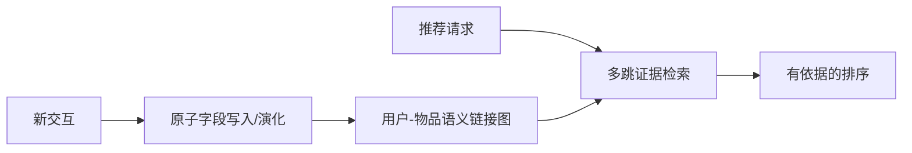
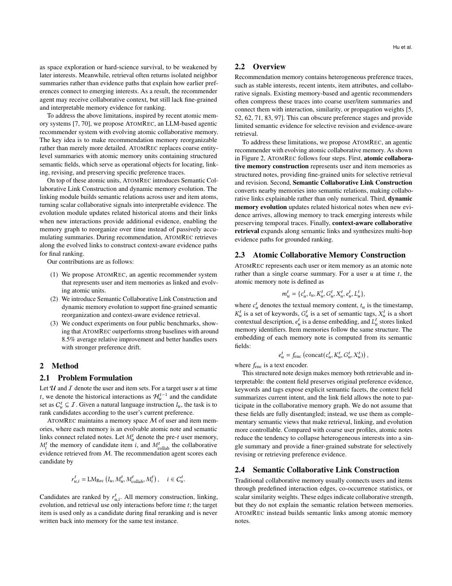

# AtomRec：面向 Agent 推荐的原子协同记忆

> **复现级别：真实 checkpoint 原子记忆实验。** 冻结 Qwen 生成字段、语义链接、历史更新与候选排序，以模型隐状态作本地 encoder；不是原论文线上系统或完整基准复现。

## 论文信息

| 字段 | 内容 |
|---|---|
| 论文链接 | [arXiv 2609.04882](https://arxiv.org/abs/2609.04882) |
| 公司/机构 | Xi'an Jiaotong-Liverpool University（第一作者第一署名单位；合作方 Xiaohongshu） |
| 首次公开日期 | 2026-09-04（arXiv v1） |
| 原文开源代码 | 否：未找到公开代码仓库（核查日期：2026-09-07） |
| Adapter / 方法 | `atomrec` |
| 本地复现代码 | [`atomrec_semantic.py`](https://github.com/daiwk/auto-research/blob/main/src/auto_research/agent_research/atomrec_semantic.py)、[`atomrec_checkpoint.py`](https://github.com/daiwk/auto-research/blob/main/src/auto_research/agent_research/atomrec_checkpoint.py) |

## 原始论文总结

### 背景与主要改动

粗粒度用户摘要会在重写时覆盖旧偏好，单一协同边又难以解释推荐。AtomRec 将用户和物品历史拆成可独立演化的原子字段，建立语义协同链接，并以多跳路径取回“为什么推荐”的证据。

<!-- paper-figure:start -->
### 原论文关键图

> **原论文 Figure 2（关键图）**：展示原子记忆、语义链接与证据路径构建。图片来自[原论文](https://arxiv.org/abs/2609.04882)，版权归原作者所有。
<!-- paper-figure:end -->

### 核心公式

查询 $q$ 的路径证据分数写为 $s(P|q)=\sum_{(u,v)\in P}\operatorname{sim}(q,m_v)+\lambda w_{uv}$；更新只改写被命中的原子字段，而非覆盖完整画像。

### 论文离线与线上效果

论文在四个公开数据集上相对 agentic 与 memory-augmented 基线取得约 8.5% 的跨指标平均相对提升。

## 本地复现

### 2026-09-08 保真度更正

旧版直接返回评测标签，原准确率/计划成功率作废。入口现在只接收 task_id、intent、context；读取 answer、plan 或隐藏 required_tools 会在回归测试中报错。新 legacy 结果仅是公开文本格式解析诊断，即使为 1 也不是 Agent 能力；cost 是读取记录数，不是实际工具费用。

每个 held-out 时点都重新建立 pre-target 记忆，目标与未来行为不进入记忆提示；模型生成的链接只能引用给定历史 ID。下游排序由同一冻结 checkpoint 的 mean-hidden-state encoder 对给定候选做余弦排序，保证候选集闭合，同时不接收目标标签。非法链接或畸形 JSON 直接记失败，不回填标准答案。

统一 Agent mini-suite 的 seeds 42/43/44 记录原子写入、多跳检索、回答/计划成功率与成本，见 [`metrics/mini-suite-seeds42-44.json`](metrics/mini-suite-seeds42-44.json)。

> **本地对照口径**：Amazon Beauty 2014 5-core 上做 6 用户、10 候选、seeds 42/43/44 的 next-product 小样本对照，不是论文完整候选协议。完整结果见 [`metrics/amazon-beauty-checkpoint-seeds42-44.json`](metrics/amazon-beauty-checkpoint-seeds42-44.json)，GPU 执行收据见 [`atomrec-checkpoint-a100-20260910.json`](../../gpu-validations/atomrec-checkpoint-a100-20260910.json)。validation 上 AtomRec Hit@3 为 0.333/0.167/0.333，recent-history 为 0.500/0.500/0.667；test 上 AtomRec 三个 seed 均为 0，recent-history 为 0.500/0.667/0.667。一个 test case 的语义 linker 越权引用被严格记零，因此 AtomRec 有效率为 0.833。该负结果证明完整记忆链路与失败策略执行，不支持效果提升声明。

## 复现边界

未获得原作者代码、提示词和完整实验配置；Qwen 隐状态不是论文的 SentenceT5，Amazon Beauty 也不代表 Xiaohongshu 线上分布。本地不声称复刻原系统或线上实验。
