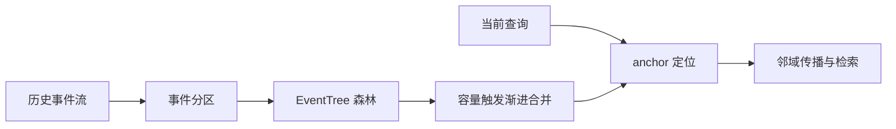
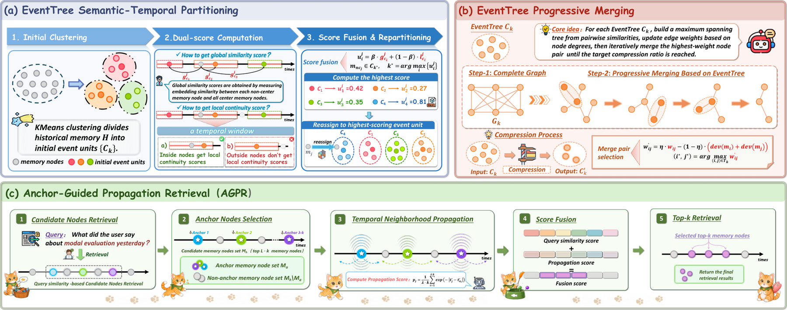

# MemForest：事件树组成的长期记忆森林

> **复现级别：公开观察解析诊断。** 实现事件分区、渐进合并与 anchor 邻域检索；语义相似度用词项重叠近似。

## 论文信息

| 字段 | 内容 |
|---|---|
| 论文链接 | [arXiv 2609.08273](https://arxiv.org/abs/2609.08273) |
| 公司/机构 | Shanghai Jiao Tong University（第一作者署名单位） |
| 首次公开日期 | 2026-09-08（arXiv v1） |
| 原文开源代码 | 是：[MemForest](https://github.com/Celina-love-sweet/MemForest) |
| Adapter / 方法 | `memforest` |
| 本地复现代码 | [`src/auto_research/agent_research/latest_20260912.py`](https://github.com/daiwk/auto-research/blob/main/src/auto_research/agent_research/latest_20260912.py) |

## 原始论文总结

### 背景与主要改动

MemForest 不把全部历史压进一条摘要，而是先按事件切分成多棵树，再在容量压力下渐进合并节点。查询从语义 anchor 出发向邻域传播，保留时间结构和跨事件关联。

<!-- paper-figure:start -->
### 原论文关键图

> **原论文 Figure 2（关键图）**：展示原论文方法的总体设计和关键组成。图片来自[原论文](https://arxiv.org/abs/2609.08273)，版权归原作者所有；点击图片可查看来源。
<!-- paper-figure:end -->

## 本地复现与边界

三种子结果见 [`metrics/mini-suite-seeds42-44.json`](metrics/mini-suite-seeds42-44.json)。本地 `EventTree` 是紧凑 CPU 数据结构，使用 token Jaccard 选择树并真实执行压缩；未运行作者 embedding、LLM 摘要器或长程 benchmark。
