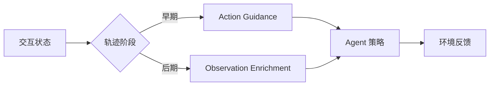
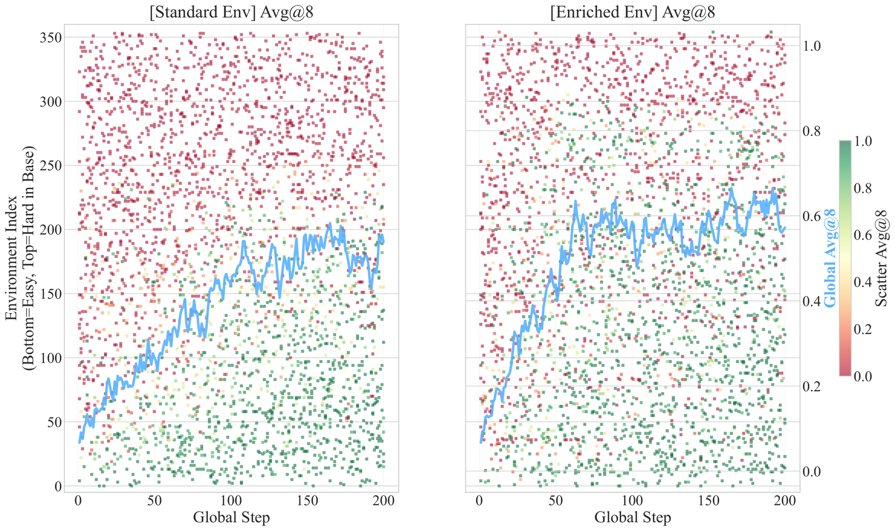

# Environments as Scaffold：随轨迹阶段切换反馈形态

> **复现级别：公开观察解析诊断。** 实现早期公开动作引导、后期观察增强的阶段切换；不读取 gold plan。

## 论文信息

| 字段 | 内容 |
|---|---|
| 论文链接 | [arXiv 2609.08404](https://arxiv.org/abs/2609.08404) |
| 公司/机构 | Fudan University（第一作者署名单位） |
| 首次公开日期 | 2026-09-08（arXiv v1） |
| 原文开源代码 | 是：[EnvAsScaffold](https://github.com/HongbangYuan/EnvAsScaffold) |
| Adapter / 方法 | `feedback-scaffold` |
| 本地复现代码 | [`src/auto_research/agent_research/latest_20260912.py`](https://github.com/daiwk/auto-research/blob/main/src/auto_research/agent_research/latest_20260912.py) |

## 原始论文总结

### 背景与主要改动

论文指出统一反馈不适合整个探索过程：早期能力不足时使用 action guidance 降低搜索难度，后期则改为 observation enrichment，让 Agent 自己选择动作，避免长期依赖示范。

<!-- paper-figure:start -->
### 原论文关键图

> **原论文 Figure 4（关键图）**：展示原论文的训练流程与关键优化环节。图片来自[原论文](https://arxiv.org/abs/2609.08404)，版权归原作者所有；点击图片可查看来源。
<!-- paper-figure:end -->

## 本地复现与边界

三种子结果见 [`metrics/mini-suite-seeds42-44.json`](metrics/mini-suite-seeds42-44.json)。第一步只可采用公开 observation 中明确给出的 workflow；后续仅加入状态摘要，隐藏 `AgentTask.plan` 从不进入策略。当前未训练 LLM，也没有真实环境 rollout。
