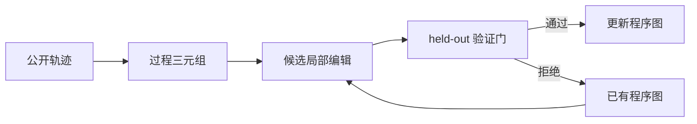
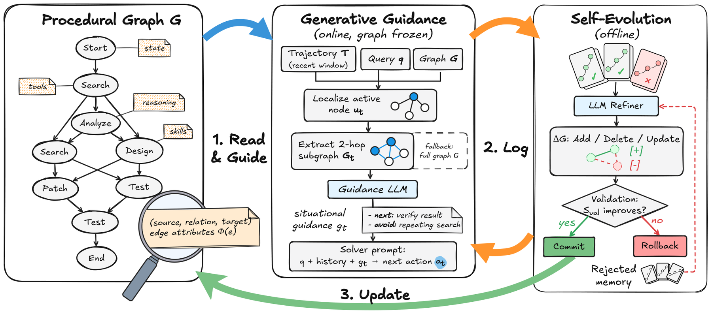

# Procedural Graphs：让 Agent 自己维护可验证的程序图

> **复现级别：公开观察解析诊断。** 实现 procedure–relation–procedure 图和保守编辑门，不包含 LLM 生成或真实环境执行。

## 论文信息

| 字段 | 内容 |
|---|---|
| 论文链接 | [arXiv 2609.09153](https://arxiv.org/abs/2609.09153) |
| 公司/机构 | Google（第一作者的第一署名单位） |
| 首次公开日期 | 2026-09-08（arXiv v1） |
| 原文开源代码 | 否：未找到作者公开仓库（核查日期：2026-09-12） |
| Adapter / 方法 | `procedural-graphs` |
| 本地复现代码 | [`src/auto_research/agent_research/latest_20260912.py`](https://github.com/daiwk/auto-research/blob/main/src/auto_research/agent_research/latest_20260912.py) |

## 原始论文总结

### 背景与主要改动

方法把成功经验从自然语言片段提升为 procedure–relation–procedure 图。新经验先局部化为候选图编辑，再经过 held-out 验证门才写入长期结构，减少错误经验污染。

<!-- paper-figure:start -->
### 原论文关键图

> **原论文 Figure 2（关键图）**：展示原论文提出的核心架构、主要模块及其连接关系。图片来自[原论文](https://arxiv.org/abs/2609.09153)，版权归原作者所有；点击图片可查看来源。
<!-- paper-figure:end -->

## 本地复现与边界

三种子 `evomem-mini` 结果见 [`metrics/mini-suite-seeds42-44.json`](metrics/mini-suite-seeds42-44.json)。本地编辑门以“已建立路线必须保留首尾节点”为确定性代理；策略看不到隐藏答案/计划，也未调用真实工具，因此仅验证图更新与拒绝路径。
