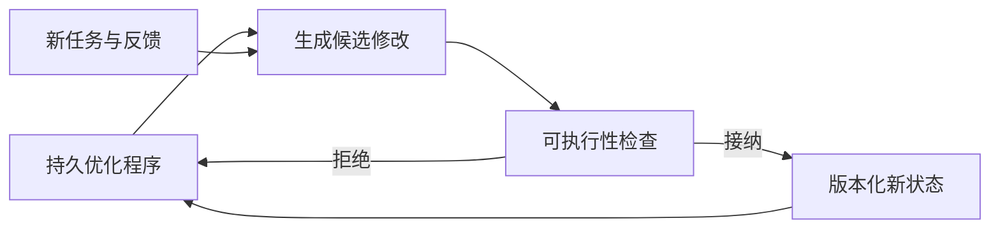
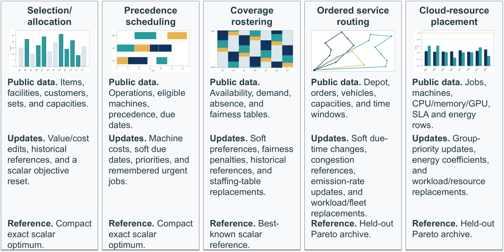

# MAPLE：持续维护可执行优化程序的自进化 Agent

> **复现级别：持久状态机制诊断。** 实现候选方案接纳、跨任务复用和版本化状态，不执行论文的数学优化器或 LLM 代码生成。

## 论文信息

| 字段 | 内容 |
|---|---|
| 论文链接 | [arXiv 2609.11636](https://arxiv.org/abs/2609.11636) |
| 公司/机构 | Harbin Institute of Technology, Shenzhen（第一作者署名单位） |
| 首次公开日期 | 2026-09-10（arXiv v1） |
| 原文开源代码 | 是：[MAPLE](https://github.com/xin8coder/MAPLE) |
| Adapter / 方法 | `maple` |
| 本地复现代码 | [`src/auto_research/agent_research/latest_20260912.py`](https://github.com/daiwk/auto-research/blob/main/src/auto_research/agent_research/latest_20260912.py) |

## 原始论文总结

### 背景与主要改动

MAPLE 把自然语言优化知识变成可持续修改的程序状态：生成候选、检查可执行性、接纳更好的方案，并把已接受程序带到后续问题中继续进化，而不是每次从零提示。

<!-- paper-figure:start -->
### 原论文关键图

> **原论文 Figure 7（关键图）**：展示原论文方法的总体设计和关键组成。图片来自[原论文](https://arxiv.org/abs/2609.11636)，版权归原作者所有；点击图片可查看来源。
<!-- paper-figure:end -->

## 本地复现与边界

三种子结果见 [`metrics/mini-suite-seeds42-44.json`](metrics/mini-suite-seeds42-44.json)。本地只接纳由非空命名操作构成的公开计划并验证后续复用；没有运行作者求解器、训练模型或外部工具，因此不把 mini-suite 成功率作为论文能力复现。
