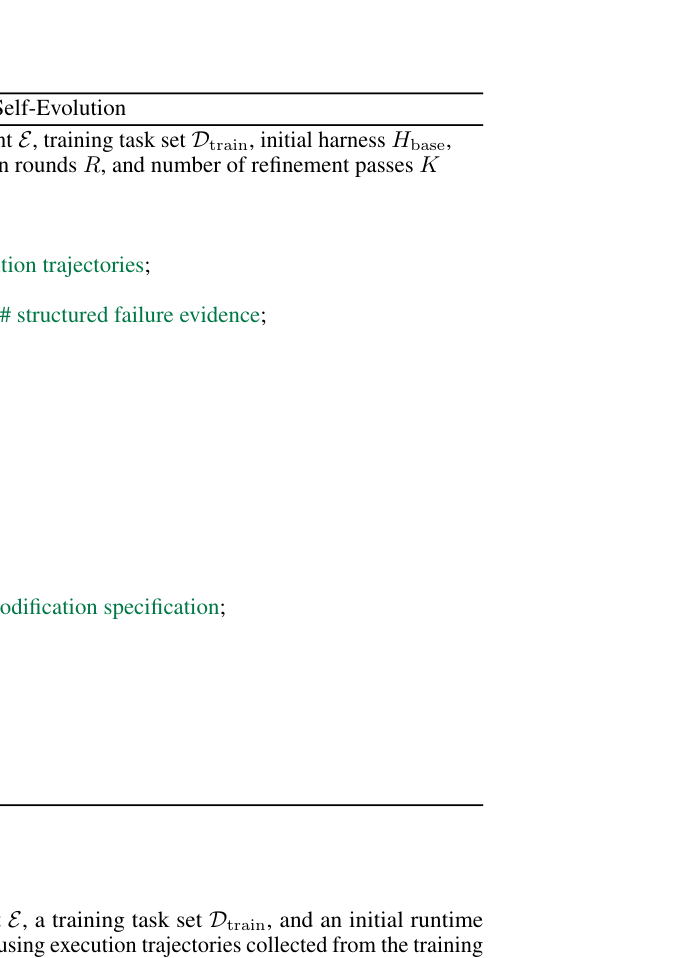

# Ecdysis: Efficient and Effective Training of Runtime Harnesses for LLM Agents

> **复现级别：L1 核心机制诊断。** 本地只在公开 observation 上聚合失败签名和触发修复门；不生成或执行 harness 代码。

## 论文信息

| 字段 | 内容 |
|---|---|
| 论文链接 | [Ecdysis: Efficient and Effective Training of Runtime Harnesses for LLM Agents](https://arxiv.org/abs/2609.11677) |
| 公司/机构 | Chengdu Institute of Computer Applications, Chinese Academy of Sciences（按第一作者署名单位） |
| 首次公开日期 | 2026-09-10 |
| 原文开源代码 | 是：[https://github.com/cuiyu-ai/Ecdysis](https://github.com/cuiyu-ai/Ecdysis) |
| Adapter / 方法 | `ecdysis` |
| 本地复现代码 | [`src/auto_research/agent_research/latest_20260914.py`](https://github.com/daiwk/auto-research/blob/main/src/auto_research/agent_research/latest_20260914.py) |

## 原始论文总结

### 背景与主要改动

聚合跨任务重复失败以区分模型偶发错误和 harness 系统缺陷，再由 FDCR 多角色诊断形成修复规格。

<!-- paper-figure:start -->
### 原论文关键图

> **原论文 Algorithm 1（关键图）**：展示原论文方法的总体设计和关键组成。图片来自[原论文](https://arxiv.org/abs/2609.11677)，版权归原作者所有；点击图片可查看来源。
<!-- paper-figure:end -->

### 核心公式或操作

本地代码把论文决定性操作实现为确定性的 reference kernel，并显式输出门控、选择、投影、图边或状态更新统计；测试覆盖公式不变量和边界条件。

### 论文离线与线上效果

harness 训练最高加速 1.84 倍，推理准确率最高提升 18.56%。 这些数字来自原论文，不与本地缩小实验直接比较；论文未报告线上 A/B 时不推断线上收益。

## 本地复现

三种子指标见 [`metrics/mechanism-seeds42-44.json`](metrics/mechanism-seeds42-44.json)。所有候选使用相同公开 fixture、预算和 seed；本页结果只证明核心状态转换实际执行。

### 复现边界

本地只在公开 observation 上聚合失败签名和触发修复门；不生成或执行 harness 代码。
