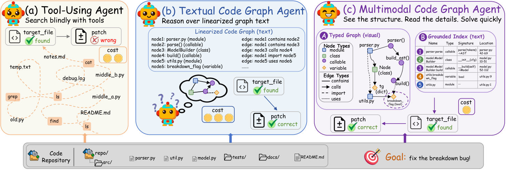

# RepoAtlas: Guiding Coding Agents via Evolving Multimodal Repository Views

> **复现级别：L1 核心机制诊断。** 本地只使用公开 observation 构造有界文本视图；未宣称接入真实 SWE-bench 浏览器环境。

## 论文信息

| 字段 | 内容 |
|---|---|
| 论文链接 | [RepoAtlas: Guiding Coding Agents via Evolving Multimodal Repository Views](https://arxiv.org/abs/2609.16936) |
| 公司/机构 | Beihang University（按第一作者署名单位） |
| 首次公开日期 | 2026-09-15（arXiv v1） |
| 原文开源代码 | 否：截至 2026-09-16 未找到原作者公开仓库 |
| Adapter / 方法 | `repoatlas` |
| 本地复现代码 | [`src/auto_research/agent_research/latest_20260916_followup.py`](https://github.com/daiwk/auto-research/blob/main/src/auto_research/agent_research/latest_20260916_followup.py) |

## 原始论文总结

### 背景与主要改动

在固定预算下执行 select–project–refresh，把任务相关代码子图同步投影为视觉拓扑与精确文本索引。

<!-- paper-figure:start -->
### 原论文关键图

> **原论文 Figure 1（关键图）**：展示原论文方法的总体设计和关键组成。图片来自[原论文](https://arxiv.org/abs/2609.16936)，版权归原作者所有；点击图片可查看来源。
<!-- paper-figure:end -->

### 核心公式与实现对应

本地 reference kernel 保留决定性的排序、门控、偏好方向、信用权重或状态转换，并输出可审计统计。三种子 fixture 用来验证不变量和边界，不把随机 mini-suite 分数解释成论文能力。

### 论文效果

论文中的准确率、速度、训练损失或 benchmark 结论只作为原文结果；本地结果不与其直接横比，也不外推线上收益。

## 本地复现

三种子结果见 [`metrics/mechanism-seeds42-44.json`](metrics/mechanism-seeds42-44.json)。统一 receipt 标记 `diagnostic_only=true`，不能进入正式能力排名。

## 复现边界

本地只使用公开 observation 构造有界文本视图；未宣称接入真实 SWE-bench 浏览器环境。
